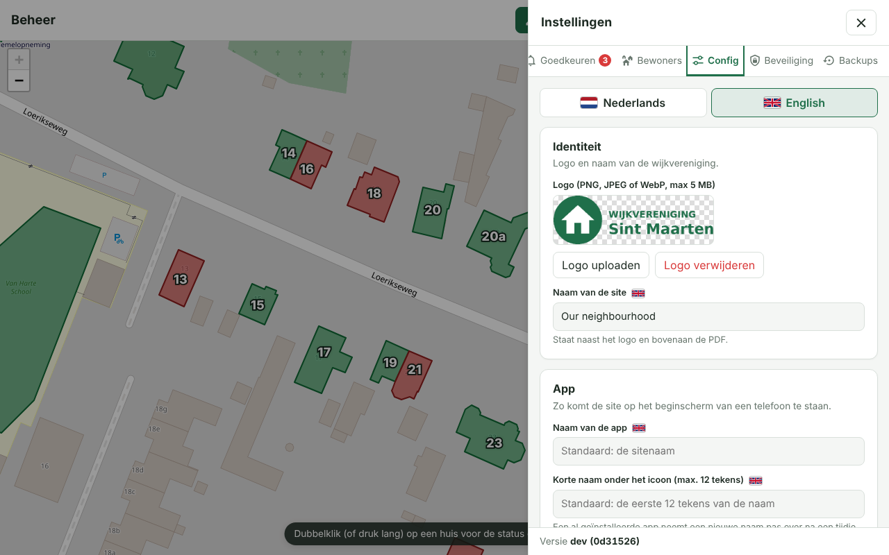
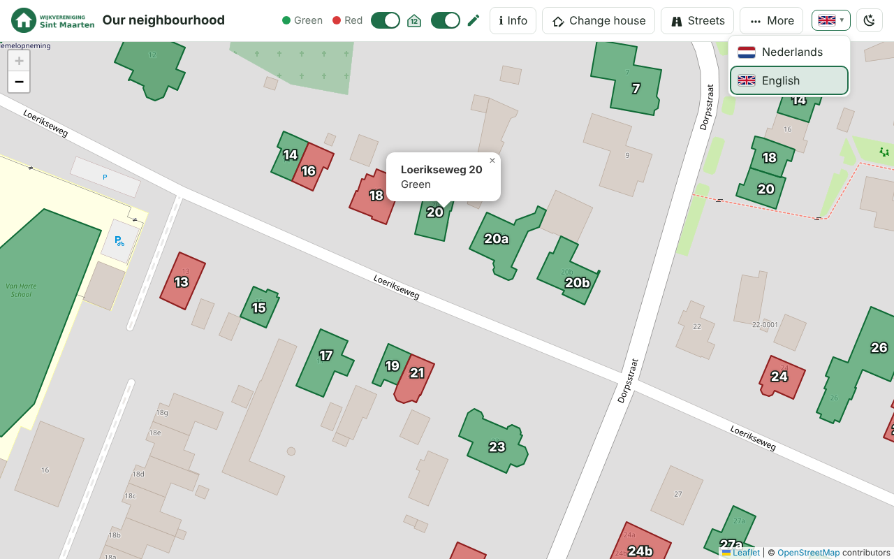
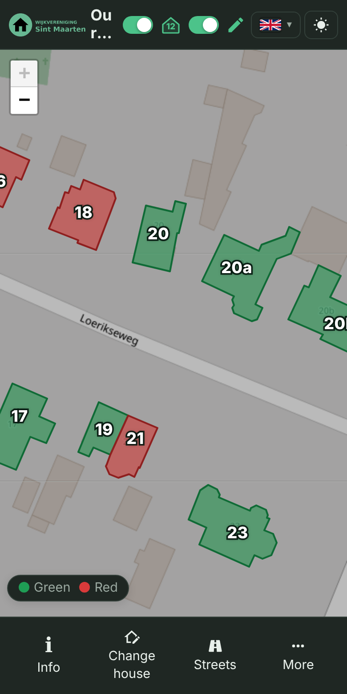
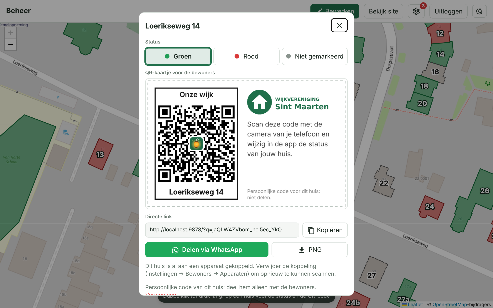
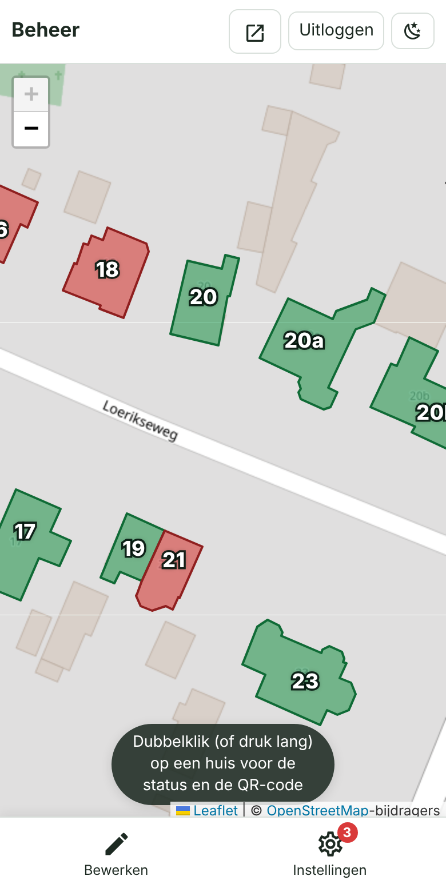
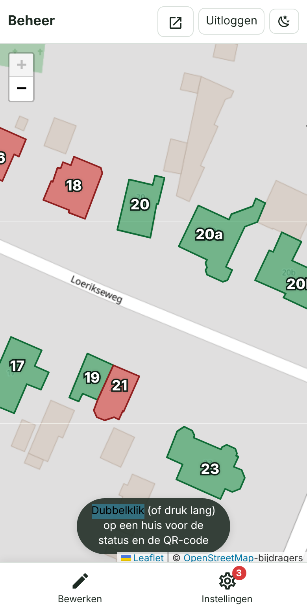
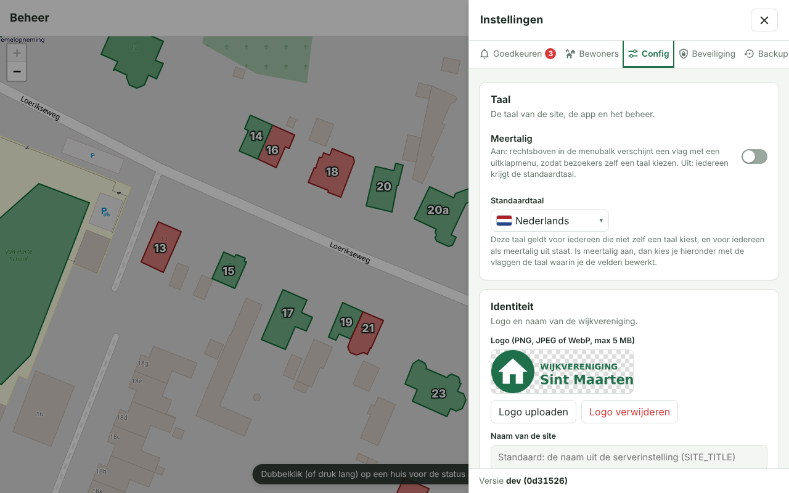

# Halloween – interactive neighbourhood map

🇳🇱 [Nederlandse versie van deze README](README.md)

> This is the English version of the README. The screenshots show the Dutch interface; the app itself can be switched to English (see [Languages and dark mode](#languages-and-dark-mode)).

An interactive map of the neighbourhood in which every house is **green**, **red** or **not marked** (for example for a Halloween event: which houses do or do not want visitors to ring the bell). Visitors view the map in the browser or as an app on their phone; the admin draws the houses and manages everything in `/beheer` (the admin area), secured with a **passkey**. It runs as a single Docker container, for example on a NAS: you deploy it with [`docker-compose.yml`](docker-compose.yml) and your own `.env` (a copy of [`.env.example`](.env.example)); see [Deploy it yourself with Docker](#deploy-it-yourself-with-docker).

## Contents
- [Features in brief](#features-in-brief)
- [The website for visitors](#the-website-for-visitors)
- [Residents: changing a house](#residents-changing-a-house)
- [Access via QR code](#access-via-qr-code-optional)
- [Languages and dark mode](#languages-and-dark-mode)
- [The admin area](#the-admin-area-beheer)
- [Settings](#settings)
- [Installing as an app and offline use](#installing-as-an-app-and-offline-use)
- [Deploy it yourself with Docker](#deploy-it-yourself-with-docker)
- [Releases and release notes](#releases-and-release-notes)

## Features in brief

**For visitors**
- Map based on OpenStreetMap (no API key) with coloured areas over the houses; click a house for its note.
- House numbers on the map (switch), a street filter with green/red counts, and an information window.
- **PDF** (A4 landscape) with map, legend, totals, logo, explanation and an overview of the marked houses, including date and time.
- **Installable as an app (PWA)** with its own Halloween icon and **offline** use.
- Works on phone (menu bar at the bottom, floating status bar) and desktop.
- **Multilingual** (Dutch and English, can be switched on in the admin area) and a **dark/light mode** with a button at the top right. See [Languages and dark mode](#languages-and-dark-mode).

**For residents**
- Residents change the status of **their own house** (one house per device); the admin approves it. See [Residents: changing a house](#residents-changing-a-house).
- Quickly go to your house with a double-click or long-press.
- Optional: choose a house **only with the QR code** from the letter (one device per house), with a location check (geofence) and/or an access code for devices without GPS. See [Access via QR code](#access-via-qr-code-optional).

**For the admin**
- Draw and edit houses (colour, street, house number, note, corner points), set the map view (centre, zoom, min/max).
- Log in with a **passkey** (optionally also with a password, confirmed with a passkey).
- **Approve or reject** changes by residents, with **push notifications**; **block** devices (also by IP); **schedule** changes until a date and time.
- **QR codes** per house: show, copy the link, renew, and a **printable PDF** with a card per house to deliver to the residents.
- Settings in five clear tabs; the admin area can also be installed as its own **app**.
- Your own **logo, explanation, info box, site and app name** and your own names for the statuses.
- Automatic **backups** after every save attempt, with short titles and manual backups.
- Version number and commit visible in the settings menu.

## The website for visitors

Example with random houses (map data © OpenStreetMap contributors).

<table>
<tr><td align="center" valign="top"><a href="docs/screenshots/publiek.png"></a><br><sub>Public map</sub></td><td align="center" valign="top"><a href="docs/screenshots/straten-popup.png"></a><br><sub>Show/hide streets per street</sub></td><td align="center" valign="top"><a href="docs/screenshots/uitleg.png"></a><br><sub>Explanation with info box</sub></td></tr>
</table>

<table>
<tr><td align="center" valign="top"><a href="docs/screenshots/mobiel.png"></a><br><sub>Mobile</sub></td><td align="center" valign="top"><a href="docs/screenshots/straten-popup-mobiel.png"></a><br><sub>Streets (mobile)</sub></td><td align="center" valign="top"><a href="docs/screenshots/info-vlak-mobiel.png"></a><br><sub>Info box in the explanation</sub></td></tr>
</table>

**Public map** – with the association's logo; click a house for its note. At the top are the buttons for the explanation, the streets and the *More* menu (⋯) with the PDF buttons.

**Mobile** – at the top only the logo, the title, the switches for house numbers and edit and (on the right) the language choice and the dark/light button; the actions (info, streets, More) are at the bottom, with the status bar (green/red) always just above them.

**Streets** – with the street icon (🛣️) in the menu bar you switch the houses of each street on or off on the map (and in the PDF). Per street it shows how many houses are **green** and **red**, and at the top the total of the visible streets.

**Explanation and info box** – the association's text; it is shown automatically the first time and closes with the cross at the top right. At the top is the eye-catching green **info box** explaining that residents can change their own house; it disappears as soon as changing is switched off.

**PDF export** – A4 landscape with legend, totals and the date and time (HH:MM) of the status. Page 2 contains the logo, the explanation and the overview of the marked houses. The PDF follows the chosen streets and the house numbers.

<table>
<tr><td align="center" valign="top"><a href="docs/screenshots/pdf.png"></a><br><sub>PDF: map with legend and totals</sub></td><td align="center" valign="top"><a href="docs/screenshots/pdf-toelichting.png"></a><br><sub>PDF: logo, explanation and overview</sub></td></tr>
</table>

## Residents: changing a house
- In the **installed app** (PWA) the menu bar always has a **Change house** button, plus a **Sync** button (🔄) with which you update the houses immediately (the app also refreshes itself every 30 seconds).
- In a **regular browser** there is an **Edit** switch (✏️) at the top. It is **on by default** (if you switch it off, the browser remembers that), so the *Change house* button is in the menu bar; switch it off and that button disappears. *Save PDF* and *View PDF* are under the **More** menu (⋯), also in the app. On a small screen the bar with the status colours always floats just above the menu bar. In the app this switch is hidden.

<table>
<tr><td align="center" valign="top"><a href="docs/screenshots/bewerken-meer-mobiel.png"></a><br><sub>More menu</sub></td><td align="center" valign="top"><a href="docs/screenshots/bewoner-kies-huis.png"></a><br><sub>Choosing a house</sub></td><td align="center" valign="top"><a href="docs/screenshots/bewoner-wacht.png"></a><br><sub>Waiting for approval</sub></td><td align="center" valign="top"><a href="docs/screenshots/bewoner-heropend.png"></a><br><sub>App reopened: the link stays</sub></td></tr>
</table>

**Quickly to your house** – with a mouse you double-click a house, on a touchscreen you long-press it (a little over half a second). *Edit* is then switched on (in the browser), the map jumps to the house and change mode starts; if you have not chosen a house yet, the app asks whether it is your house. A double-click outside the houses simply zooms in. In the admin area the same gesture selects the house in select mode.

**In the admin area** this works too: double-click (or long-press) a house and select mode switches on with that house selected, even if you were just drawing (as long as no area is in progress).

### Access via QR code (optional)
If you want residents to only be able to link **their own house**, switch on *Choose a house only via QR code* under *Settings → Residents → Access via QR code*. Every house then has its own QR code with a secret that is **not** on the map (the house ids are public, which is why the secret is separate).
- **Handing out:** choose *Print QR codes (PDF)* (all streets or one street): an A4 with a card per house to deliver to the residents. The QR is one whole: the site title at the top and street + house number at the bottom are built into the image, with the Halloween icon in the middle of the code. For a selected house in the editor a **QR code** button shows the code, lets you **copy the link**, download it as a PNG or **renew** it.
- **Sharing via WhatsApp:** in the house popup there is *Share via WhatsApp* (and, on a phone, sharing the card) with a prepared text. You change that text under *Settings → Config → Texts → Text when sharing via WhatsApp* (per language; *Residents → Access via QR code* has a pointer with a *Go to Config* button). The message and the card are in the default language of the site; when *Multilingual* is on, the popup has a language picker (with flags) to show and share them in another language, and the printable PDF follows the default language; `{adres}` becomes the address of the house and `{link}` the personal link (if `{link}` is missing, the link is added after the text). Empty = default text.
- **Resident:** scans the code with the phone's camera, confirms "Is this your house?" and can then change the house. In the *Change house* screen, without a link, only the instructions to scan are shown; the map and the address list then no longer work for choosing a house.
- **One device per house:** if a house is already linked, the server refuses a second device. Remove the link (*Settings → Residents → Devices*) to be able to scan again.
- **Already linked, or house taken:** if someone scans a QR with a device that is already linked to a house (or a house that is linked to another device), a window appears to send the admin a **short message** (max. 300 characters), for example for a new phone or a move. The admin gets a push notification.
- **Revoking:** *Renew* (per house or all houses) invalidates the old QR codes.
- **Combination:** a valid QR replaces the access code for devices without GPS; the location check and the admin's approval still apply. If you switch QR-only off, everything works as before (map/list).
- **Note:** a QR is only as safe as the letter: anyone who photographs it can use it (hence one device per house, renewing and your approval). On iPhone a scanned link opens in the browser, not in the installed app; if you use *Only in the installed app*, the resident has to open the app after scanning. The secrets are in `data/db.json`, not in the backups.

<table>
<tr><td align="center" valign="top"><a href="docs/screenshots/qr-instellingen.png"></a><br><sub>Settings: Access via QR code</sub></td><td align="center" valign="top"><a href="docs/screenshots/qr-dialoog.png"></a><br><sub>QR code of one house</sub></td></tr>
<tr><td align="center" valign="top"><a href="docs/screenshots/qr-pdf.png"></a><br><sub>Printable PDF with a card per house</sub></td><td align="center" valign="top"><table><tr><td align="center" valign="top"><a href="docs/screenshots/qr-bevestigen.png"></a><br><sub>After scanning: confirm</sub></td><td align="center" valign="top"><a href="docs/screenshots/qr-zonder-scan.png"></a><br><sub>Without QR (QR-only)</sub></td></tr></table></td></tr>
</table>

**Scheduling changes** – under *Settings → Residents → Schedule* switch on *Switch off changing at a date and time* and pick the moment with the date/time picker. Until that moment residents can make changes (browser and app); after that it is off. The two switches below it are disabled and ignored during that time; if you switch the schedule off, they apply again.

**Still switching green ↔ red after the end date** – next to the schedule is the switch *After the end date still switch between green and red*. If it is on, residents who already have a house can, after the end date, still switch their own house from green to red or the other way round (not from or to *not marked*, and not choose a new house), still with your approval. The *Change house* button then only shows those two colours; visitors without a house no longer see the button (or *Edit*). This switch takes precedence over the two switches below it and only works when the schedule is on.

**Simple display** – under *Settings → Config → Display* switch on *Simple display*. On the website the *House numbers* and *Edit* switches and the *Streets* button then disappear; *Info*, *Change house* and *Save PDF* are then directly in the menu bar (the *More* menu is dropped) and Edit is always on.

**Access code for devices without GPS (optional)** – under *Settings → Residents → Access* you set a code of 4 to 6 digits (or choose *Random*) and switch on the switch. Anyone who then presses *Change house* on a laptop or desktop first gets a field to enter the code (which you share, for example, in the neighbourhood app on WhatsApp). The device remembers the code (cookie, 1 year); if you change the code, everyone has to enter it again. Phones and tablets with GPS do not have to enter anything. This is off by default. Wrong attempts are limited per IP address. It is a usage restriction, not hard security (the code is stored in readable form for the admin, and the device type comes from the browser).

**Geofence (optional)** – under *Settings → Residents → Access* you switch on *Only in the neighbourhood (location)* and choose a radius (50–5000 m, default 500). The centre is the centre of the map view (or else of the houses). The check applies **only to phones and tablets with GPS**; laptops and desktops (without GPS) are not restricted and can simply make changes. When opening change mode and with every change the browser asks for the location; if it is outside the radius, less accurate than 200 m, off or not allowed, changing is not possible and a clear message follows. Viewing the map is possible anywhere. Requires HTTPS. The location comes from the device itself and the server cannot verify it: it is a usage restriction, not hard security.

**Info box** – under *Settings → Config → Texts* there is a separate text field for the info box. It appears as a striking green block at the top of the explanation on the website and explains that residents can change their own house. It disappears automatically as soon as changing by residents is switched off (or the scheduled date has passed).

**Preventing abuse** – under *Settings → Approve* and *Residents → Devices* every pending change and every registered device has a **Block** button. The device loses its link and pending changes, and can no longer make changes or choose a house. You can also block the **IP address** (note: housemates or neighbours behind the same router often share an IP). Under *Blocked* you remove a block again.

**Only allow in the app** – under *Settings → Residents* switch on **Only in the installed app**. The *Edit* switch then disappears for browser visitors (also on an open page, after refreshing), and the server refuses changes that do not come from the app. The app identifies itself with a header (`X-App-Mode: standalone`). That is a usage restriction: anyone who imitates the requests can send the header along, but every change must still be approved by the admin.

- A resident taps their house (or chooses their address) and confirms. That device is then linked to **one house** (cookie, 1 year). A single tap on your own house does nothing special (a popup, as with any house); changing only starts with **double-clicking or long-pressing** (or *Change house*). After that every tap on that house (or a choice in the window) switches the colour: not marked → green → red → not marked. Other houses cannot be changed.
- The change is **only visible to others after the admin approves it**. In the meantime the resident sees the house with a dotted border and the message *Waiting for approval*; after the decision a message follows (approved or not applied). The admin can always change the status of a house themselves; a pending proposal then follows the new status or lapses if it matches exactly.
- Only a random device token (as a hash), the IP address of the last request (for blocking) and the chosen house are stored, no names or other personal data.
- The link and the proposal are **kept after closing the app**: they are on the server, with a local copy of the token as a backup (in case the cookie is cleared) and of the last status (in case there is no connection). Your own house also stays visible outside change mode (⏳ while the change is waiting for approval, then 🏠).
- The app **refreshes itself** (every 30 seconds, and as soon as you return to the app or are back online). If the admin approves a change, it appears on the device by itself, including a message "Your change has been approved".

## Languages and dark mode
- **Default language** – under *Settings → Config → Language* you choose the default language with a drop-down menu (with flags): 🇳🇱 Nederlands or 🇬🇧 English. That language applies to the site, the app, the PDFs, the admin area and the push notifications to the admin, **even when multilingual is off**.
- **Multilingual** – with the *Multilingual* switch (off by default) a flag with a drop-down menu with the supported languages appears at the top right of the menu bar. A visitor's choice is remembered in their browser and applies to that visitor (the admin area follows the same choice). If the switch is off, everyone gets the default language.
- **Texts per language** – when *Multilingual* is on, the *Config* tab has a **language bar with flags** below the language block. The fields below it are per language: choose a flag and you edit the name of the site and the app, the short name, the names of the statuses, the info box, the explanation and the text when sharing via WhatsApp for that language; a small flag next to a field shows which language it applies to. What you type is kept when you switch language until you press *Save*. An empty field in another language falls back to the Dutch text (the default info box and the default WhatsApp text are translated automatically); Dutch remains the source. When *Multilingual* is off you edit the fields of the default language. The logo and the other settings apply to all languages. In the English display the Dutch name of the tradition is replaced by *Halloween* everywhere.
- **Dark/light** – next to the flag is a button (moon/sun) with which every visitor switches between the light and the dark display. By default the site follows the device's setting; the choice is remembered. In the dark display the **logo inverts automatically** (black becomes white) and the map is dimmed a little. The button is always visible, even when multilingual is off.
- **Adding translations** – the source of all texts is Dutch; a dictionary per language (`public/js/lang-en.js`, key = Dutch text, value = translation; `{name}` is a variable) translates the page in the browser and the push notifications on the server. The tests (`npm test`) check that every translation has the same variables.

<table>
<tr><td align="center" valign="top"><a href="docs/screenshots/instellingen-config-talen.png"></a><br><sub>Config: language bar with flags</sub></td><td align="center" valign="top"><a href="docs/screenshots/publiek-engels-taalmenu.png"></a><br><sub>English site with language menu</sub></td><td align="center" valign="top"><a href="docs/screenshots/mobiel-engels-donker.png"></a><br><sub>Mobile: English and dark</sub></td></tr>
</table>

## The admin area (`/beheer`)

<table>
<tr><td align="center" valign="top"><a href="docs/screenshots/onboarding.png"></a><br><sub>Onboarding with setup code</sub></td><td align="center" valign="top"><a href="docs/screenshots/beheer-login.png"></a><br><sub>Logging in with passkey</sub></td></tr>
<tr><td align="center" valign="top"><a href="docs/screenshots/beheer-tekenen.png"></a><br><sub>Drawing a house</sub></td><td align="center" valign="top"><a href="docs/screenshots/beheer.png"></a><br><sub>Editing a house</sub></td></tr>
</table>

**Onboarding** – the first time you create a passkey with the setup code (`SETUP_TOKEN`).

**Logging in** – with a passkey (fingerprint, face, PIN or security key), optionally with a password that you confirm with a passkey.

**View and edit** – the admin area opens in **view** mode: only the map, without a side bar. Double-click (or long-press on a touchscreen) a house for a **popup** with which you directly make the house **green, red or not marked** (it is saved immediately) and which contains the **QR card** for the residents: with logo, address, QR and explanation. Below it are the **direct link** with a copy button, a **Share via WhatsApp** button (opens WhatsApp with a ready-made message and the link), on phones also **Share card…** (the image via the share menu), a **PNG** to download and *Renew*. With **✏️ Edit** you open the edit screen (drawing houses, selecting, searching, map view); **✓ View** takes you back (with unsaved changes it asks first).

**Bottom bar** – on a phone and in the installed admin app there is a bar at the bottom with **Edit** and **Settings** (with a badge for waiting notifications); on a laptop those buttons are in the header.

<table>
<tr><td align="center" valign="top"><a href="docs/screenshots/beheer-huis-popup.png"></a><br><sub>Popup on a laptop</sub></td><td align="center" valign="top"><a href="docs/screenshots/beheer-weergave-mobiel.png"></a><br><sub>View with bottom bar</sub></td><td align="center" valign="top"><a href="docs/screenshots/beheer-huis-popup-mobiel.png"></a><br><sub>Popup on a phone</sub></td></tr>
</table>

**Drawing a house** – choose a colour and click the corner points of the house; finish with the yellow starting point, a double-click or Enter. New houses get *no status* by default and the active street.

**Editing a house** (in the edit screen) – select a house (click, double-click or long-press) to change the colour, street, house number and note, or drag the corner points. Shortcuts: **G** green, **R** red, **Delete** delete, **Ctrl+S** save. The list on the left has a filter per street; the rest is dimmed on the map.

## Settings
The cog (⚙) in the bar slides the settings menu into view. It is divided into five tabs (*Approve*, *Residents*, *Config*, *Security* and *Backups*, with icons from [Material Design Icons](https://pictogrammers.com/library/mdi/), Apache License 2.0); each tab consists of cards with clear switches and a short explanation (also on a phone).

<table>
<tr><td align="center" valign="top"><a href="docs/screenshots/instellingen-goedkeuren.png"></a><br><sub>Approve</sub></td><td align="center" valign="top"><a href="docs/screenshots/instellingen-bewoners.png"></a><br><sub>Residents</sub></td><td align="center" valign="top"><a href="docs/screenshots/instellingen-bewoners-apparaten.png"></a><br><sub>Residents: devices and notifications</sub></td></tr>
<tr><td align="center" valign="top"><a href="docs/screenshots/instellingen-config.png"></a><br><sub>Config</sub></td><td align="center" valign="top"><a href="docs/screenshots/instellingen-beveiliging.png"></a><br><sub>Security</sub></td><td align="center" valign="top"><a href="docs/screenshots/instellingen-backups.png"></a><br><sub>Backups</sub></td></tr>
</table>

<p align="center"><a href="docs/screenshots/instellingen-mobiel.png"></a><br><sub>Settings on a phone</sub></p>

**Approve** – the changes that residents requested for their own house and the **messages from residents**. Red **badges** with the number are at the cog, at the tab and at every list, in the page title and – in the installed admin area – on the **app icon**; they are also updated by a push notification when the app is closed. Approve or reject changes (or everything at once) and click *Dealt with* on a message to remove it.

**Residents** – everything around changing by residents:
- *Changes by residents*: on/off, and optionally only in the installed app (the *Edit* switch then disappears in the browser and the server refuses changes without the app header `X-App-Mode: standalone`).
- *Schedule*: close changing automatically at a date and time (with a date picker), optionally still switching green ↔ red afterwards.
- *Access*: only in the neighbourhood (location/geofence) and an access code for devices without GPS.
- *Devices*: registered devices, **alphabetical** by street and house number (handy for searching with many houses), with removing the link or **blocking** (optionally with IP address), and the *Blocked* list.
- *Notifications on this device*: push notifications for new changes.

**Config** – language (multilingual and default language), logo, name of the site and the app, the simple display, the names of the statuses, the info box, the explanation and the text when sharing via WhatsApp (the texts per language).

**Security** – add/remove passkeys and an optional password (confirm with passkey).

**Backups** – after every save attempt a backup of the layout and texts is made automatically. Give a backup a **short title** (✎, max. 40 characters, for example "Everything" or "Layout only") or make one yourself with *Make backup*. Restoring or downloading is always possible; deleting (one or several at once) must be confirmed with your passkey.

**Version** – at the bottom of the menu is the version and commit of the running build (see [Version number](#version-number)).

### Push notifications for the admin
- In *Settings → Residents → Notifications on this device* turn on notifications on your own phone or computer. The server creates the (VAPID) keys itself and stores them in `data/db.json`.
- For a new change you receive a push notification (several changes shortly after each other are combined). If you tap it, the admin area opens at *Approve* and you can approve or reject; only then is the change applied.
- Requires **HTTPS**. On an iPhone/iPad Web Push only works if you first add the admin area to the home screen (iOS 16.4 or newer) and open it from there. A *Test notification* button checks whether it works.
- Expired devices are cleaned up automatically.

## Names of the statuses
Under *Settings (⚙) → Config → Display* you can change the names **Green**, **Red** and **Not marked**, for example to *Agreed* and *Not visited yet*. The colours stay green and red. The names apply everywhere: legend, popups, street filter, the PDF, the admin area and the push notification. Leave empty = default name.

## Drawing new houses
A newly drawn house has **no status** by default (not marked; in the admin area you can choose another status for new houses if you like). The **Street for new houses** field shows the active or last used street: it follows the house you select, the street filter or what you enter yourself. New, still empty houses get that street filled in beforehand, so you only have to enter the house number.

## House numbers and streets
- In the admin area every house has a **street** and a **house number** (separate fields; the street field suggests existing streets). With *Filter by street* you show only the houses of one street in the list; the rest is dimmed on the map.
- The *House numbers on the map* switch shows the number in the middle of every house (white with a dark outline, so easy to read). Numbers that do not fit in the house disappear and return when zooming in further.
- In *Set map view* you decide whether the numbers are **on by default** for visitors; visitors can switch that themselves with the switch in the menu bar (the choice is remembered).
- On the site you can hide or show the houses per street with the street icon. The PDF follows those choices (house numbers and visible streets).
- Older data with one *house number/name* field is converted automatically: that field becomes the house number.

## How it works
- **Map**: OpenStreetMap (via Leaflet), no API key needed. Google Maps was deliberately not used: it requires a paid key and its terms do not allow drawing over it and exporting to PDF.
- **Setting up the admin area**: search for your street and zoom in far; set the centre, the start zoom and the minimum/maximum zoom via *Set map view* (or adopt the current view). Visitors open the map (also in the app) with exactly that view; with *Automatic* the site shows all houses. In the same dialog you decide whether the house numbers are on by default for visitors.
- **Onboarding**: the very first time `/beheer` asks for the `SETUP_TOKEN` and then creates a passkey. After that you can add extra devices via *Settings* (⚙) → *Security* (do that so you do not get locked out).

> The PDF fetches map tiles directly from OpenStreetMap; keep usage modest
> ([tile usage policy](https://operations.osmfoundation.org/policies/tiles/)).

## Logging in with a password (optional)
By default you can only log in with a passkey. If you also want to be able to log in with a password, set it via *Settings* (⚙) → *Security* → *Password*
(at least 10 characters). Setting, changing or removing it must be **confirmed with a passkey**. The password is only stored as a `scrypt` hash.
A session started with a password can manage the map and texts, but cannot change passkeys or the password; for that you log in with a passkey.
Failed attempts are limited per IP address and globally.

## After an update: old pages or scripts
Scripts and styles are requested per build with `?v=<version>-<commit>` and the HTML is never cached; this way you never get an old `admin.js` with new HTML (which gives errors such as
*Cannot set properties of null*). If you still see such an error after an update, refresh hard (Ctrl+Shift+R) or clear the site data; a proxy/CDN (e.g. Cloudflare) may be caching too aggressively.

## Releases and release notes
For every successful build on `main` the GitHub Action sets a tag `vMAJOR.MINOR.PATCH` (see [Version number](#version-number)) and also publishes a **GitHub Release** with official release notes: [all releases](../../releases). The notes are compiled automatically from the merged pull requests since the previous release, divided into **✨ New features and improvements**, **🐞 Fixed problems** and **📚 Documentation**, each with a link to the PR, plus the `docker pull` command for that version.
- **Layout:** a PR from a `fix/…` branch (or with fix/repair/crash in the title) counts as a fixed problem, a `docs/…` branch as documentation, the rest as a new feature. A clear PR title and a short list under *Wijzigingen* (changes) in the description therefore go straight into the release notes.
- **Handwritten notes:** if you put a file `docs/releases/vX.Y.Z.md` in place, the release uses that instead of the automatic notes (this is how [v1.0.0](docs/releases/v1.0.0.md) was made).
- **Creating (again) afterwards:** Actions → *Release* → *Run workflow* and enter the tag (for example `v1.0.5`). You can try it locally with `node tools/release-notes.js vX.Y.Z` (with `GITHUB_TOKEN` and `GITHUB_REPOSITORY` set).

## Version number
At the bottom of the settings menu (⚙) are the version and the commit of the running build, for example **v1.0.3 (9f2c4e1)**.
With every successful build of the GitHub Action the patch number goes up by 1 (the first build is v1.0.0); the build gets a git tag `v1.0.N` and the image is
also published under that tag (`ghcr.io/helmerznl/sintmaarten:v1.0.3`). The `1.0` part comes from the `VERSION` file: change that for a new minor or major version, and the counter starts again at 0.
Locally (without a build) the app shows `dev` with the commit from git. The workflow needs write access to the repo to set the tag (it is in `docker.yml`).

## Backups
After **every save attempt** (houses/layout, texts, map view) the server makes a JSON backup in `data/backups/` of the layout (houses + map view) and the texts (explanation, app name).
Identical states are not stored twice and the newest 200 are kept (`MAX_BACKUPS` to change that). The logo is not part of the backups.
Restoring is possible in *Settings → Backups* (the current state is first saved as a backup itself); deleting asks for confirmation with your passkey.
Every backup can get a **short title** (max. 40 characters, ✎ button), for example "Everything" or "Layout only". With *Make backup* you make a backup manually with your own title, even if nothing has changed.

## Name of the app
Under *Settings* (⚙) → *Config* you also set the **name of the site** (next to the logo and in the PDF; default `SITE_TITLE`) and the **name of the app** and a short name (max. 12 characters, under the icon). Those are used when the site is installed on a phone or computer.
Without input the site name (`SITE_TITLE`) applies. An already installed app only adopts a new name after a while.

## Admin area as an app
The admin area (`/beheer`) can also be installed as its own app, with its own dark blue lantern with a cog as the icon and its own favicon, so you can tell it apart from the public map (Chrome/Edge: install icon in the address bar or *Install app*; iPhone/iPad: *Add to Home Screen*). The app opens directly at `/beheer`; push notifications for new changes use the same icon. You make a new icon with `python3 tools/make-icons.py`.

## Installing as an app and offline use
- **Android and Windows (Chrome/Edge)**: you get a **one-time** prompt to install the app (*Install* / *Not now*), remembered per device. After that it is also possible via the browser menu → *Install app*.
- **iPhone/iPad**: the same one-time prompt with instructions (see below).
- **iPhone/iPad (Safari)**: share icon → *Add to Home Screen*.
- **Offline**: the app stores itself, the last known map data, the logo and the map tiles of the neighbourhood (and the PDF section).
  Without a connection you see the last known state (with the message *Offline*), and the PDF can still be made. Only the admin area always requires a connection.
- This only works over **HTTPS** (see `ORIGIN`). After an update of the site the app fetches the new version on the next visit.

## Deploy it yourself with Docker
You run the app on your own Docker environment (NAS, server, Raspberry Pi, VPS) with two files from this repository:

| File | What for |
| --- | --- |
| [`docker-compose.yml`](docker-compose.yml) | Describes the container: the image `ghcr.io/helmerznl/sintmaarten:latest`, the port, the `./data` folder for your data and that the settings come from `.env`. |
| [`.env.example`](.env.example) | Example of your settings. Copy it to `.env` and fill it in; `.env` contains secrets and does **not** belong in git. |

You do not have to build the code: the image is built and published automatically by [GitHub Actions](.github/workflows/docker.yml) (see the [Dockerfile](Dockerfile) for the build instructions).

**Steps**
1. Create a folder on your Docker host, for example `sintmaarten`, and download the two files:
   ```sh
   mkdir sintmaarten && cd sintmaarten
   curl -O https://raw.githubusercontent.com/helmerzNL/Sintmaarten/main/docker-compose.yml
   curl -o .env https://raw.githubusercontent.com/helmerzNL/Sintmaarten/main/.env.example
   ```
   (Or copy the contents of [`docker-compose.yml`](docker-compose.yml) and [`.env.example`](.env.example) by hand; save `.env.example` as `.env`.)
2. Fill in `.env`:

   | Variable | Meaning |
   | --- | --- |
   | `ORIGIN` | The full URL with which you open the site, for example `https://sintmaarten.flux76.app`. Must be exactly the address in the browser; passkeys only work over **HTTPS** (or on `localhost`). |
   | `SETUP_TOKEN` | Secret code for creating the very first passkey (onboarding). Generate one with `openssl rand -hex 12`. |
   | `SESSION_SECRET` | Key for signing sessions (at least 16 characters), for example `openssl rand -hex 32`. If you leave it empty, sessions expire at every restart. |
   | `SITE_TITLE` | Name of the site (can be changed later in the admin area). |
   | `PORT` | Port of the web server, default **9888**. |
   | `RP_ID`, `SESSION_HOURS` | Optional; see the comments in [`.env.example`](.env.example). |
3. Start the container: `docker compose up -d`. Your data (houses, passkeys, logo, explanation, backups) is in `./data`; the container restores the permissions on that folder itself (it starts briefly as root and then runs the app as user `node`).
4. Put a reverse proxy with **HTTPS** in front of the port from `PORT` (Synology: *Login Portal → Reverse Proxy*, or Nginx Proxy Manager / Traefik / Caddy), so that `ORIGIN` is correct.
5. Open `ORIGIN/beheer` and create your first passkey with the `SETUP_TOKEN` (see [Onboarding](#the-admin-area-beheer)).

**Updating:** `docker compose pull && docker compose up -d`. **Back-up:** copy the `data/` folder (or use the backups in the admin area).

> Is the GHCR package private? Make it public (GitHub → Packages → Package settings), or log in with
> `docker login ghcr.io` (username + Personal Access Token with `read:packages`).

## GitHub Actions
`.github/workflows/docker.yml` runs the tests and, on every push to `main`/`master`, builds a multi-arch image
(amd64 + arm64) to `ghcr.io/helmerznl/sintmaarten:latest`. Update on the NAS with `docker compose pull && docker compose up -d`.

## Local development
```
npm install
ORIGIN=http://localhost:9888 SETUP_TOKEN=local-test-token-1 npm start
npm test
```
You regenerate the screenshots in this README with `node tools/screenshots.js` (Playwright + Chromium and internet for the map tiles; the example data is in `tools/screenshots/`, the buildings come from OpenStreetMap © OpenStreetMap contributors). With one or more words after it you only make the screenshots with that name, for example `node tools/screenshots.js qr`.

## Security
Passkeys via WebAuthn (SimpleWebAuthn), session cookie `HttpOnly`/`SameSite=Strict`/`Secure`, origin check on changes,
limiting of failed attempts.
Back-up: copy the `data/` folder. Lost your passkey and have no other device? Set `"passkeys": []` in `data/db.json`
and go through the onboarding again.
