# Sint Maarten – interactieve wijkkaart

Publieke kaart van de wijk waarop huizen groen of rood zijn gemarkeerd, met een beheerscherm
(`/beheer`) dat beveiligd is met een **passkey**.

## Screenshots

Voorbeeld met willekeurige huizen (kaartgegevens © OpenStreetMap-bijdragers).

**Publieke kaart** – met het logo van de vereniging; klik op een huis voor de notitie. Bovenaan staan de knoppen voor de uitleg, de PDF en (op een telefoon) het installeren als app.

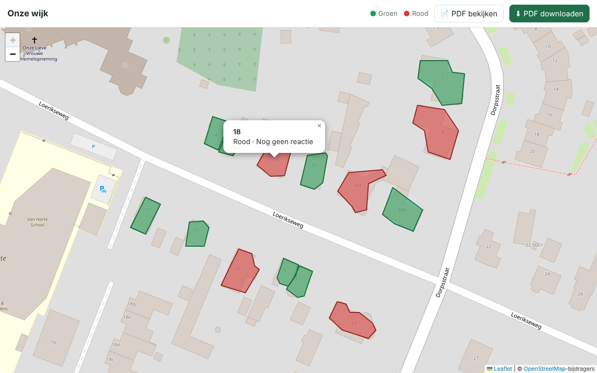

**Mobiel** – bovenaan alleen het logo, de titel en de schakelaar voor huisnummers; de acties (uitleg, straten, PDF opslaan) staan onderaan.

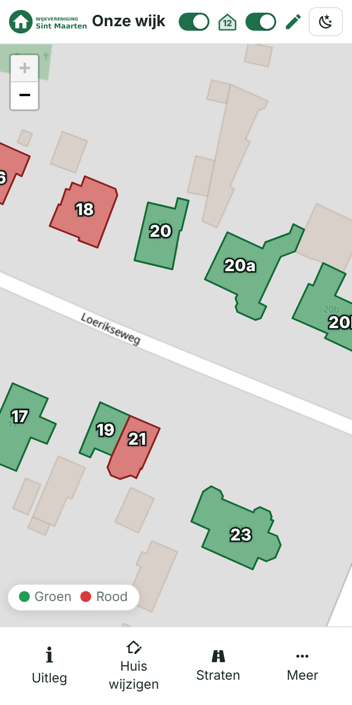

**Straten** – met het straat-icoon (🛣️) in de menubalk zet je per straat de huizen op de kaart (en in de PDF) aan of uit.

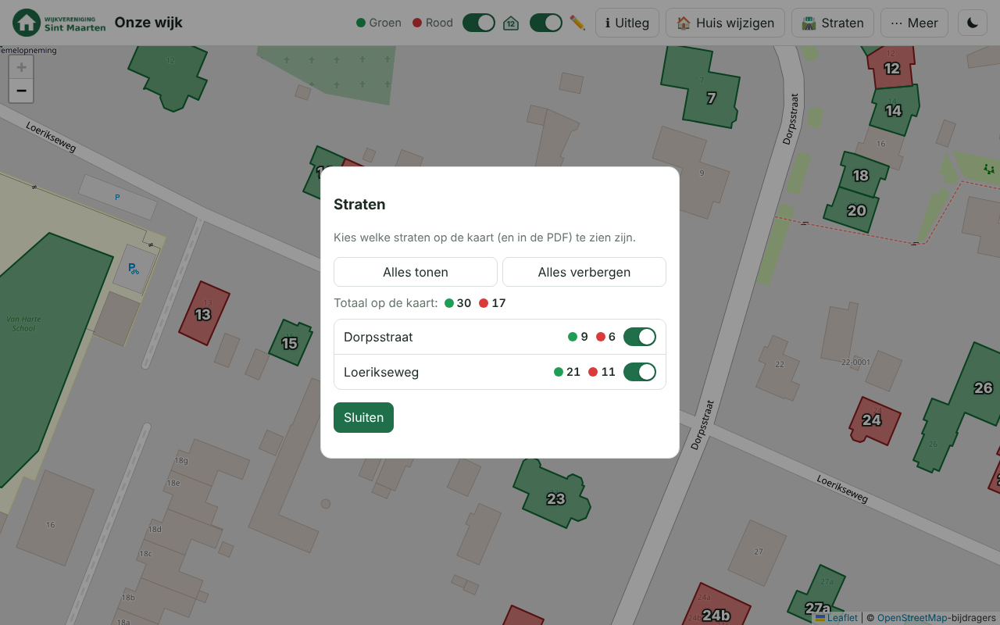

**Uitleg** – de tekst van de vereniging; wordt de eerste keer automatisch getoond.

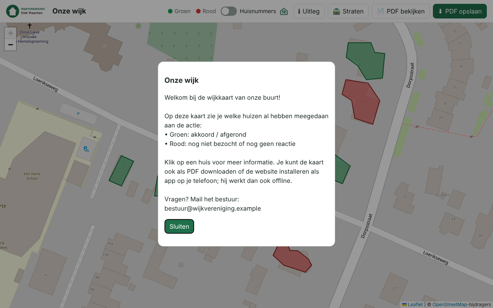

### Beheer (`/beheer`)

**Onboarding** – de eerste keer maak je een passkey aan met de installatiecode.

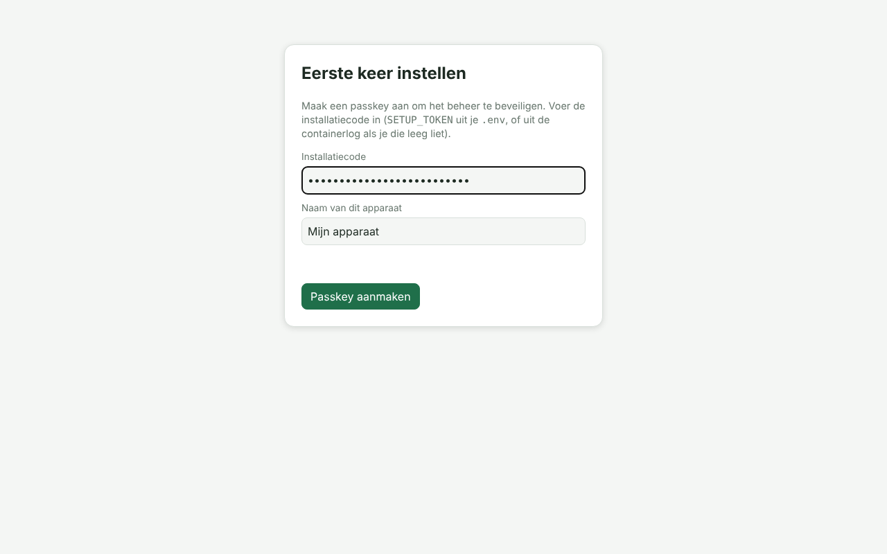

**Inloggen** – alleen met passkey (vingerafdruk, gezicht, pincode of beveiligingssleutel).

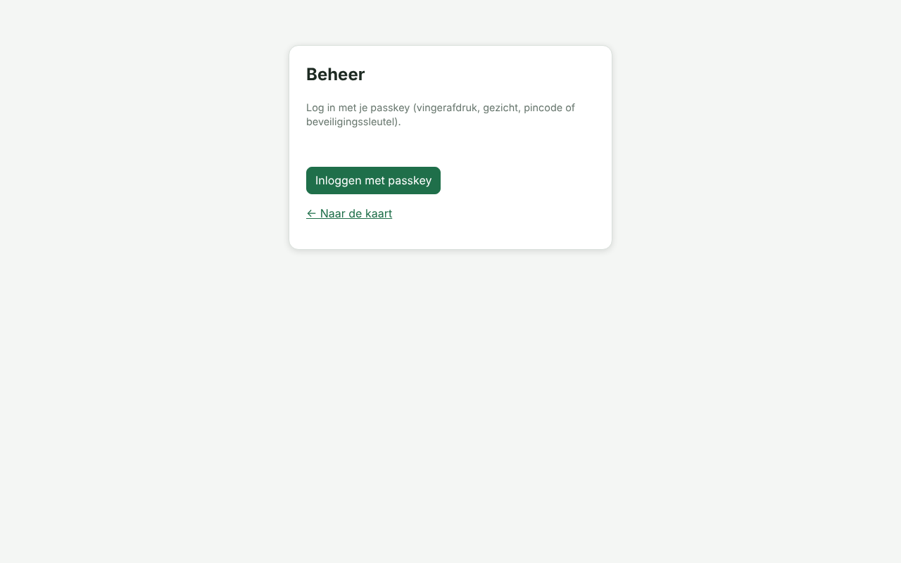

**Huis tekenen** – kies een kleur en klik de hoekpunten van het huis; sluit af met het gele beginpunt, dubbelklik of Enter.

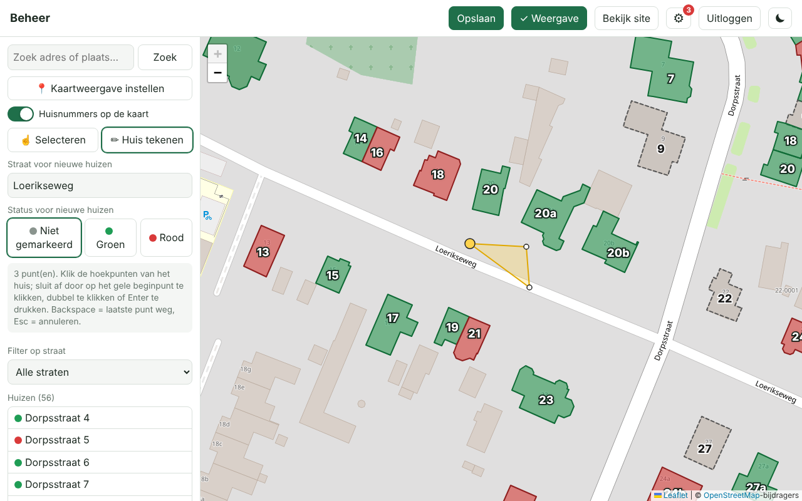

**Huis bewerken** – selecteer een huis om de kleur, het huisnummer en de notitie aan te passen, of sleep de hoekpunten.

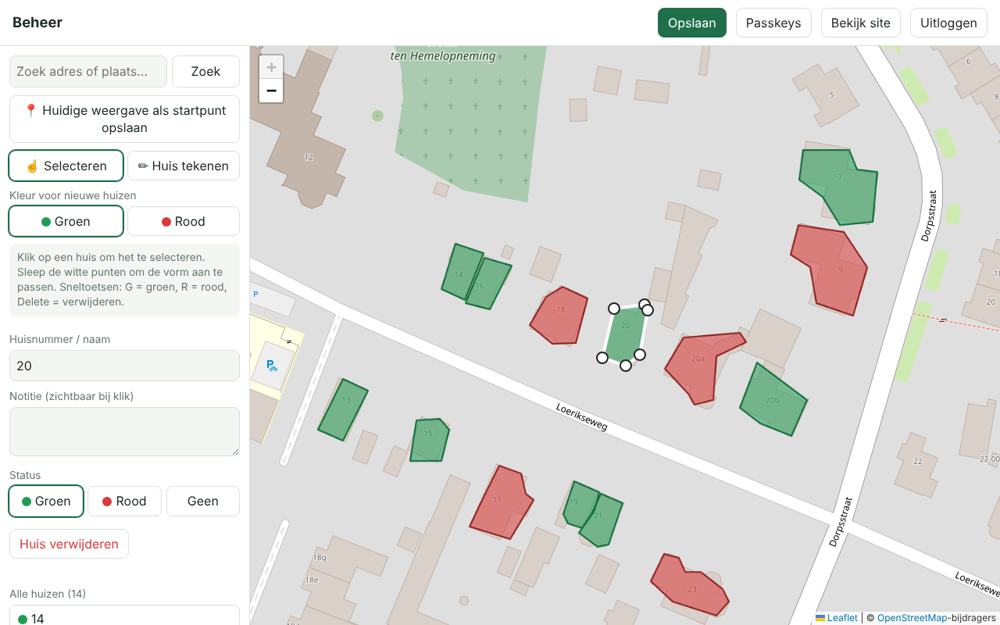

**Instellingen** – het tandwiel (⚙) in de balk schuift het instellingen-menu in beeld, met drie onderdelen:

- *Beveiliging*: passkeys toevoegen/verwijderen en een optioneel wachtwoord (bevestigen met passkey).

  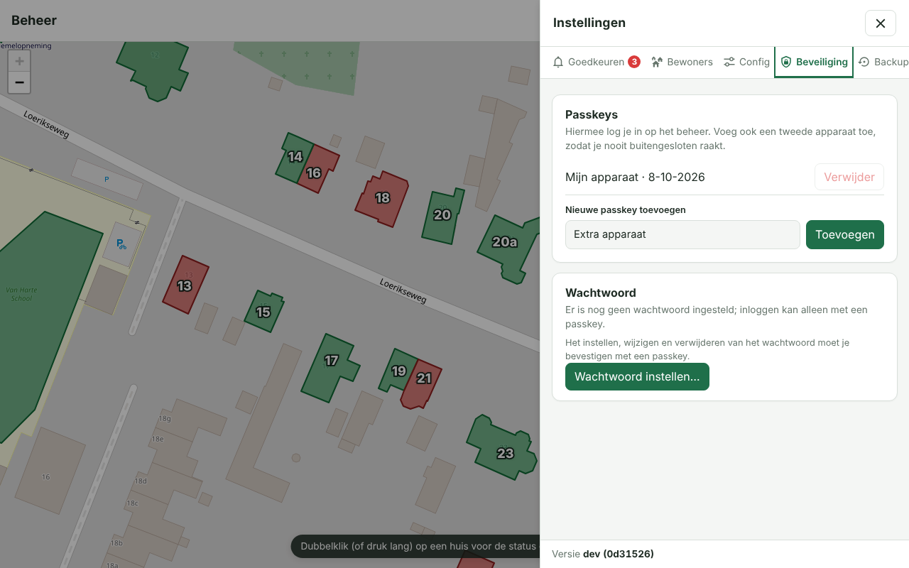

- *Backups*: na elke opslagpoging wordt automatisch een backup gemaakt van de layout en teksten. Je kunt een backup terugzetten of downloaden;
  verwijderen (één of meer tegelijk) moet je bevestigen met je passkey.

  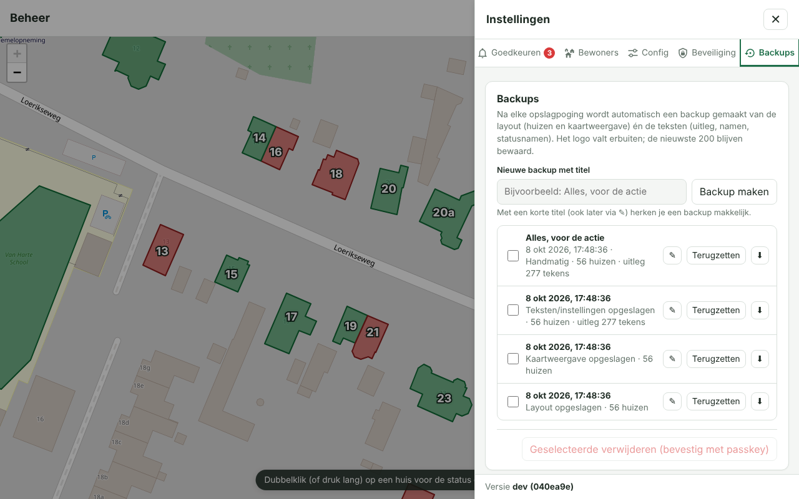

- *Logo & uitleg*: logo uploaden, naam van de app en de uitlegtekst voor de site en de PDF.

  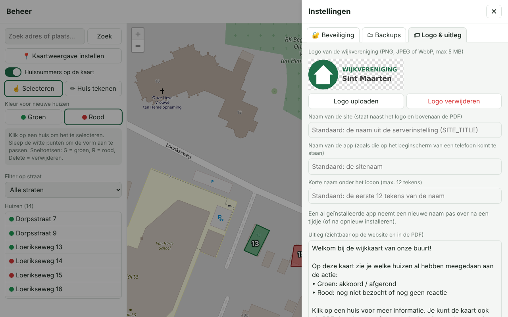

**PDF-export** – A4 liggend met legenda en aantallen (pagina 2 bevat een overzicht van de huizen).

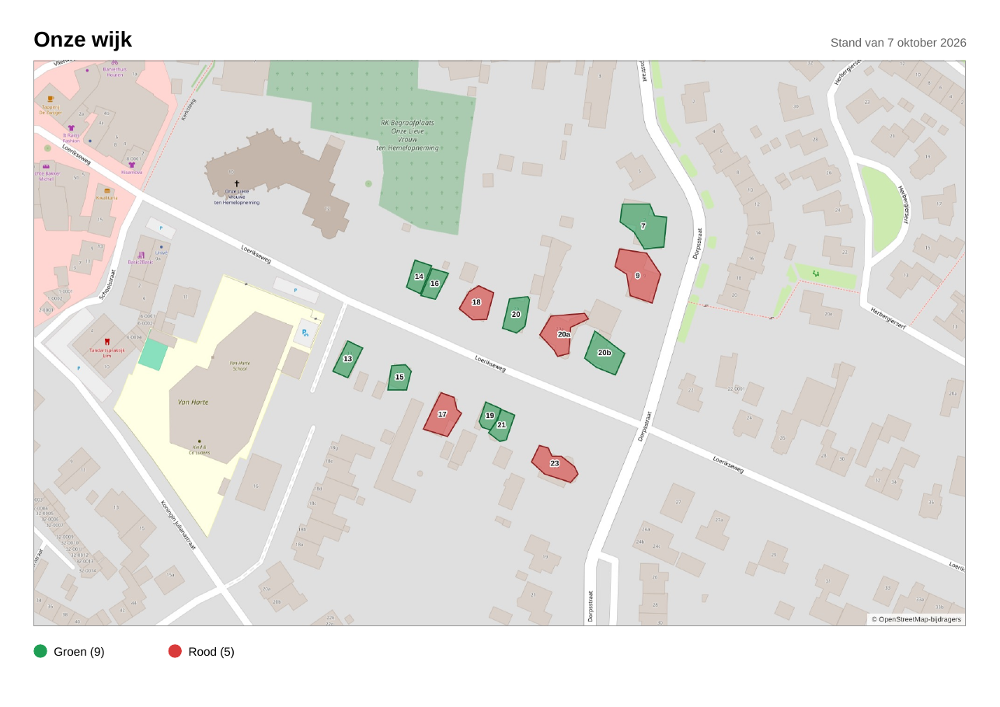

Pagina 2 bevat het logo, de uitleg en het overzicht van de gemarkeerde huizen.

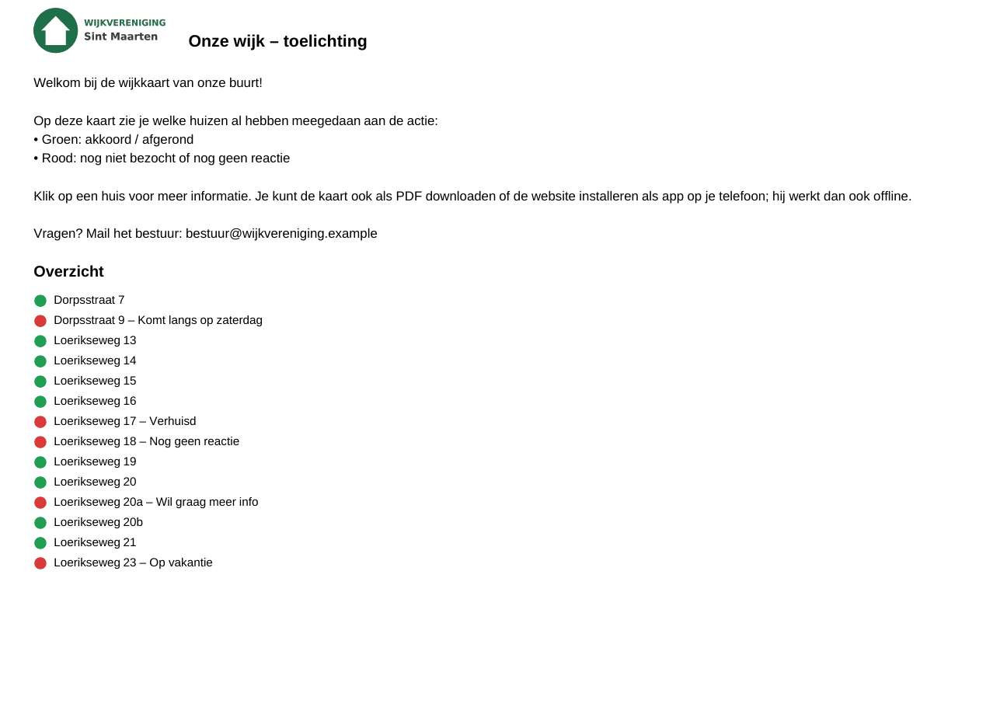

## Huisnummers en straten
- In het beheer heeft elk huis een **straat** en een **huisnummer** (aparte velden; het straatveld stelt bestaande straten voor). Met *Filter op straat* toon je alleen de huizen van één straat in de lijst; de rest wordt op de kaart gedimd.
- De schakelaar *Huisnummers op de kaart* toont het nummer midden op elk huis (wit met donkere rand, dus goed leesbaar). Nummers die niet in het huis passen verdwijnen en komen terug bij verder inzoomen.
- In *Kaartweergave instellen* bepaal je of de nummers voor bezoekers **standaard** aan staan; bezoekers kunnen dat zelf wisselen met de schakelaar in de menubalk (de keuze wordt onthouden).
- Op de site kun je met het straat-icoon per straat de huizen verbergen of tonen. De PDF volgt die keuzes (huisnummers en zichtbare straten).
- Oudere gegevens met één veld *huisnummer/naam* worden automatisch omgezet: dat veld wordt het huisnummer.

## Hoe werkt het
- **Kaart**: OpenStreetMap (via Leaflet), geen API-sleutel nodig. Google Maps is bewust niet gebruikt: dat vereist een betaalde sleutel en de voorwaarden staan het overtekenen en exporteren naar PDF niet toe.
- **Publiek (`/`)**: de kaart met gekleurde vlakken over de huizen; klik op een huis voor naam/notitie.
  Knoppen **PDF bekijken** en **PDF downloaden** maken in de browser een A4-liggend PDF van het hele wijkgebied
  (kaart, legenda met aantallen, bronvermelding, en een tweede pagina met overzicht van de gemarkeerde huizen).
- **Logo & uitleg**: in het beheer (*Instellingen* ⚙ → *Logo & uitleg*) upload je het logo (PNG/JPEG/WebP, max 5 MB) en plak je een tekst. Het logo staat in de kop van de site en de PDF;
  de tekst is op de site te lezen (knop *Uitleg*) en staat op pagina 2 van de PDF.
- **App (PWA)**: de site is te installeren op een telefoon of computer en werkt offline (zie hieronder).
- **Beheer (`/beheer`)**:
  1. Zoek je straat (zoekveld) en zoom ver in; stel via *Kaartweergave instellen* het midden, de startzoom en de minimale/maximale zoom in (of neem de huidige weergave over). Bezoekers openen de kaart (ook in de app) met precies die weergave; met *Automatisch* toont de site alle huizen.
  2. Kies *Huis tekenen*, kies groen of rood, klik de hoeken van een huis en sluit af (klik op het gele beginpunt, dubbelklik of Enter).
  3. Pas later de kleur aan (knoppen of **G**/**R**), versleep hoekpunten, geef een huisnummer/notitie, en klik *Opslaan* (Ctrl+S).
- **Onboarding**: de allereerste keer vraagt `/beheer` om de `SETUP_TOKEN` en maakt dan een passkey aan. Daarna kun je
  via *Instellingen* (⚙) → *Beveiliging* extra apparaten toevoegen (doe dat zodat je niet buitengesloten raakt).

> De PDF haalt kaarttegels rechtstreeks bij OpenStreetMap op; houd het gebruik bescheiden
> ([tile usage policy](https://operations.osmfoundation.org/policies/tiles/)).

## Inloggen met wachtwoord (optioneel)
Standaard kun je alleen met een passkey inloggen. Wil je ook met een wachtwoord kunnen inloggen, stel dat dan in via *Instellingen* (⚙) → *Beveiliging* → *Wachtwoord*
(minimaal 10 tekens). Het instellen, wijzigen of verwijderen moet je **bevestigen met een passkey**. Het wachtwoord wordt alleen als `scrypt`-hash opgeslagen.
Een sessie die met een wachtwoord is gestart kan de kaart en teksten beheren, maar geen passkeys of wachtwoord wijzigen; daarvoor log je in met een passkey.
Mislukte pogingen worden per IP-adres en globaal beperkt.

## Versienummer
Onderin het instellingenmenu (⚙) staat de versie en de commit van de draaiende build, bijvoorbeeld **v0.1.3 (9f2c4e1)**.
Bij elke geslaagde build van de GitHub Action gaat het patchnummer met 1 omhoog (de eerste build is v0.1.0); de build krijgt een git-tag `v0.1.N` en het image wordt
ook onder die tag gepubliceerd (`ghcr.io/helmerznl/sintmaarten:v0.1.3`). Het deel `0.1` komt uit het bestand `VERSION`: pas dat aan voor een nieuwe minor- of major-versie, dan begint de teller opnieuw bij 0.
Lokaal (zonder build) toont de app `dev` met de commit uit git. De workflow heeft schrijfrechten op de repo nodig om de tag te zetten (staat in `docker.yml`).

## Backups
Na **elke opslagpoging** (huizen/layout, teksten, kaartweergave) maakt de server een JSON-backup in `data/backups/` van de layout (huizen + kaartweergave) en de teksten (uitleg, appnaam).
Identieke staten worden niet dubbel bewaard en de nieuwste 200 blijven staan (`MAX_BACKUPS` om dat aan te passen). Het logo valt buiten de backups.
Terugzetten kan in *Instellingen → Backups* (de huidige staat wordt eerst zelf als backup bewaard); verwijderen vraagt een bevestiging met je passkey.

## Naam van de app
Bij *Instellingen* (⚙) → *Logo & uitleg* stel je ook de **naam van de site** in (naast het logo en in de PDF; standaard `SITE_TITLE`) en de **naam van de app** en een korte naam (max. 12 tekens, onder het icoon) in. Die worden gebruikt als de site op een telefoon of computer wordt geïnstalleerd.
Zonder invoer geldt de sitenaam (`SITE_TITLE`). Een al geïnstalleerde app neemt een nieuwe naam pas na een tijdje over.

## Installeren als app en offline gebruik
- **Android/Chrome en desktop**: open de site en kies *Installeer app* (knop in de kop) of het browsermenu → *App installeren*.
- **iPhone/iPad (Safari)**: deel-icoon → *Zet in beginscherm*.
- **Offline**: de app bewaart zichzelf, de laatst bekende kaartgegevens, het logo en de kaarttegels van het wijkgebied (en de PDF-uitsnede).
  Zonder verbinding zie je de laatst bekende stand (met de melding *Offline*), en de PDF blijft te maken. Alleen het beheer vereist altijd een verbinding.
- Dit werkt alleen via **HTTPS** (zie `ORIGIN`). Na een update van de site haalt de app de nieuwe versie bij het eerstvolgende bezoek op.

## Draaien op de NAS
1. Zet `docker-compose.yml` en een `.env` (kopie van `.env.example`) in een map op je NAS.
2. Vul `.env` in: `ORIGIN` (`https://sintmaarten.flux76.app`), optioneel `PORT` (standaard 9888), `SETUP_TOKEN`, `SESSION_SECRET`.
3. `docker compose up -d`. Data (huizen, passkeys, logo en uitleg) staat in `./data`. De container herstelt zelf de rechten op die map
   (hij start kort als root en draait de app daarna als gebruiker `node`).
4. Zet een reverse proxy met **HTTPS** voor de poort uit `PORT` (standaard **9888**) (Synology: *Inloggegevens → Reverse Proxy*, of Nginx Proxy Manager / Traefik).
   Passkeys werken alleen over HTTPS (of op `localhost`), en `ORIGIN` moet exact het adres in de browser zijn.

> Is het GHCR-package privé? Maak het publiek (GitHub → Packages → Package settings), of log op de NAS in met
> `docker login ghcr.io` (gebruikersnaam + Personal Access Token met `read:packages`).

## GitHub Actions
`.github/workflows/docker.yml` draait de tests en bouwt bij elke push naar `main`/`master` een multi-arch image
(amd64 + arm64) naar `ghcr.io/helmerznl/sintmaarten:latest`. Update op de NAS met `docker compose pull && docker compose up -d`.

## Lokaal ontwikkelen
```
npm install
ORIGIN=http://localhost:9888 SETUP_TOKEN=lokaal-test-token-1 npm start
npm test
```

## Beveiliging
Passkeys via WebAuthn (SimpleWebAuthn), sessiecookie `HttpOnly`/`SameSite=Strict`/`Secure`, origin-check op wijzigingen,
beperking op mislukte pogingen.
Back-up: kopieer de map `data/`. Passkey kwijt en geen ander apparaat? Zet in `data/db.json`
`"passkeys": []` en doorloop de onboarding opnieuw.
