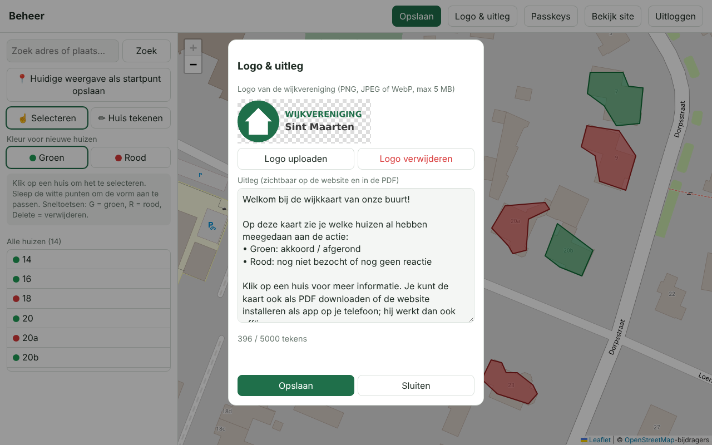
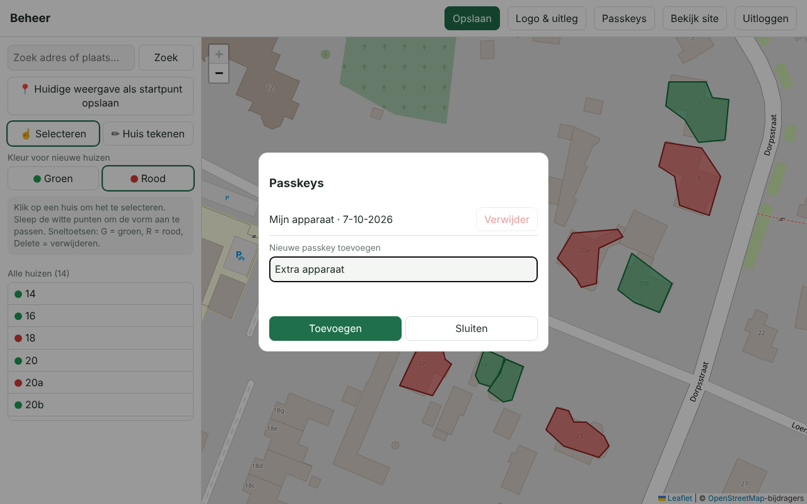

# Sint Maarten – interactieve wijkkaart

Publieke kaart van de wijk waarop huizen groen of rood zijn gemarkeerd, met een beheerscherm
(`/beheer`) dat beveiligd is met een **passkey**.

## Screenshots

Voorbeeld met willekeurige huizen (kaartgegevens © OpenStreetMap-bijdragers).

**Publieke kaart** – met het logo van de vereniging; klik op een huis voor de notitie. Bovenaan staan de knoppen voor de uitleg, de PDF en (op een telefoon) het installeren als app.


**Uitleg** – de tekst van de vereniging; wordt de eerste keer automatisch getoond.


### Beheer (`/beheer`)

**Onboarding** – de eerste keer maak je een passkey aan met de installatiecode.


**Inloggen** – alleen met passkey (vingerafdruk, gezicht, pincode of beveiligingssleutel).


**Huis tekenen** – kies een kleur en klik de hoekpunten van het huis; sluit af met het gele beginpunt, dubbelklik of Enter.


**Huis bewerken** – selecteer een huis om de kleur, het huisnummer en de notitie aan te passen, of sleep de hoekpunten.


**Logo & uitleg** – upload het logo van de wijkvereniging en plak een stukje uitleg; beide komen op de site en in de PDF.



**Passkeys beheren** – voeg extra apparaten toe zodat je niet buitengesloten raakt.



**PDF-export** – A4 liggend met legenda en aantallen (pagina 2 bevat een overzicht van de huizen).


Pagina 2 bevat het logo, de uitleg en het overzicht van de gemarkeerde huizen.


## Hoe werkt het
- **Kaart**: OpenStreetMap (via Leaflet), geen API-sleutel nodig. Google Maps is bewust niet gebruikt: dat vereist een betaalde sleutel en de voorwaarden staan het overtekenen en exporteren naar PDF niet toe.
- **Publiek (`/`)**: de kaart met gekleurde vlakken over de huizen; klik op een huis voor naam/notitie.
  Knoppen **PDF bekijken** en **PDF downloaden** maken in de browser een A4-liggend PDF van het hele wijkgebied
  (kaart, legenda met aantallen, bronvermelding, en een tweede pagina met overzicht van de gemarkeerde huizen).
- **Logo & uitleg**: in het beheer (knop *Logo & uitleg*) upload je het logo (PNG/JPEG/WebP, max 5 MB) en plak je een tekst. Het logo staat in de kop van de site en de PDF;
  de tekst is op de site te lezen (knop *Uitleg*) en staat op pagina 2 van de PDF.
- **App (PWA)**: de site is te installeren op een telefoon of computer en werkt offline (zie hieronder).
- **Beheer (`/beheer`)**:
  1. Zoek je straat (zoekveld) en zoom ver in; sla eventueel *Huidige weergave als startpunt* op.
  2. Kies *Huis tekenen*, kies groen of rood, klik de hoeken van een huis en sluit af (klik op het gele beginpunt, dubbelklik of Enter).
  3. Pas later de kleur aan (knoppen of **G**/**R**), versleep hoekpunten, geef een huisnummer/notitie, en klik *Opslaan* (Ctrl+S).
- **Onboarding**: de allereerste keer vraagt `/beheer` om de `SETUP_TOKEN` en maakt dan een passkey aan. Daarna kun je
  via *Passkeys* extra apparaten toevoegen (doe dat zodat je niet buitengesloten raakt).

> De PDF haalt kaarttegels rechtstreeks bij OpenStreetMap op; houd het gebruik bescheiden
> ([tile usage policy](https://operations.osmfoundation.org/policies/tiles/)).

## Installeren als app en offline gebruik
- **Android/Chrome en desktop**: open de site en kies *Installeer app* (knop in de kop) of het browsermenu → *App installeren*.
- **iPhone/iPad (Safari)**: deel-icoon → *Zet in beginscherm*.
- **Offline**: de app bewaart zichzelf, de laatst bekende kaartgegevens, het logo en de kaarttegels van het wijkgebied (en de PDF-uitsnede).
  Zonder verbinding zie je de laatst bekende stand (met de melding *Offline*), en de PDF blijft te maken. Alleen het beheer vereist altijd een verbinding.
- Dit werkt alleen via **HTTPS** (zie `ORIGIN`). Na een update van de site haalt de app de nieuwe versie bij het eerstvolgende bezoek op.

## Draaien op de NAS
1. Zet `docker-compose.yml` en een `.env` (kopie van `.env.example`) in een map op je NAS.
2. Vul `.env` in: `ORIGIN` (`https://sintmaarten.flux76.app`), optioneel `PORT` (standaard 9888), `SETUP_TOKEN`, `SESSION_SECRET`.
3. `docker compose up -d`. Data (kaart + huizen + passkeys) staat in `./data`.
4. Zet een reverse proxy met **HTTPS** voor de poort uit `PORT` (standaard **9888**) (Synology: *Inloggegevens → Reverse Proxy*, of Nginx Proxy Manager / Traefik).
   Passkeys werken alleen over HTTPS (of op `localhost`), en `ORIGIN` moet exact het adres in de browser zijn.

> Is het GHCR-package privé? Maak het publiek (GitHub → Packages → Package settings), of log op de NAS in met
> `docker login ghcr.io` (gebruikersnaam + Personal Access Token met `read:packages`).

## GitHub Actions
`.github/workflows/docker.yml` draait de tests en bouwt bij elke push naar `main`/`master` een multi-arch image
(amd64 + arm64) naar `ghcr.io/helmerznl/sintmaarten:latest`. Update op de NAS met `docker compose pull && docker compose up -d`.

## Lokaal ontwikkelen
```
npm install
ORIGIN=http://localhost:9888 SETUP_TOKEN=lokaal-test-token-1 npm start
npm test
```

## Beveiliging
Passkeys via WebAuthn (SimpleWebAuthn), sessiecookie `HttpOnly`/`SameSite=Strict`/`Secure`, origin-check op wijzigingen,
beperking op mislukte pogingen.
Back-up: kopieer de map `data/`. Passkey kwijt en geen ander apparaat? Zet in `data/db.json`
`"passkeys": []` en doorloop de onboarding opnieuw.
