# Sint Maarten – interactieve wijkkaart

Een interactieve kaart van de wijk waarop elk huis **groen**, **rood** of **niet gemarkeerd** is (bijvoorbeeld voor een Sint Maarten-actie: welke huizen willen wel of niet dat er wordt aangebeld). Bezoekers bekijken de kaart in de browser of als app op hun telefoon; de beheerder tekent de huizen en beheert alles in `/beheer`, beveiligd met een **passkey**. Draait als één Docker-container op bijvoorbeeld een NAS: je deployt hem met [`docker-compose.yml`](docker-compose.yml) en een eigen `.env` (kopie van [`.env.example`](.env.example)); zie [Zelf deployen met Docker](#zelf-deployen-met-docker).

## Inhoud
- [Functies in het kort](#functies-in-het-kort)
- [De website voor bezoekers](#de-website-voor-bezoekers)
- [Bewoners: huis wijzigen](#bewoners-huis-wijzigen)
- [Toegang via QR-code](#toegang-via-qr-code-optioneel)
- [Het beheer](#het-beheer-beheer)
- [Instellingen](#instellingen)
- [Installeren als app en offline gebruik](#installeren-als-app-en-offline-gebruik)
- [Zelf deployen met Docker](#zelf-deployen-met-docker)
- [Releases en release notes](#releases-en-release-notes)

## Functies in het kort

**Voor bezoekers**
- Kaart op basis van OpenStreetMap (geen API-sleutel) met gekleurde vlakken over de huizen; klik op een huis voor de notitie.
- Huisnummers op de kaart (schakelaar), straten-filter met tellingen groen/rood, en een uitleg- en infovenster.
- **PDF** (A4 liggend) met kaart, legenda, aantallen, logo, uitleg en een overzicht van de gemarkeerde huizen, inclusief datum en tijd.
- **Installeerbaar als app (PWA)** met eigen Sint Maarten-icoon en **offline** gebruik.
- Werkt op telefoon (menubalk onderin, zwevend statusbalkje) en desktop.

**Voor bewoners**
- Bewoners wijzigen de status van **hun eigen huis** (één huis per apparaat); de beheerder keurt dat goed. Zie [Bewoners: huis wijzigen](#bewoners-huis-wijzigen).
- Snel naar je huis met dubbelklikken of lang indrukken.
- Optioneel: huis kiezen **alleen met de QR-code** uit de brief (één apparaat per huis), met locatiecontrole (geofence) en/of een toegangscode voor apparaten zonder GPS. Zie [Toegang via QR-code](#toegang-via-qr-code-optioneel).

**Voor de beheerder**
- Huizen tekenen en bewerken (kleur, straat, huisnummer, notitie, hoekpunten), kaartweergave instellen (midden, zoom, min/max).
- Inloggen met **passkey** (optioneel ook met wachtwoord, bevestigd met een passkey).
- Wijzigingen van bewoners **goedkeuren of afwijzen**, met **pushmeldingen**; apparaten **blokkeren** (ook op IP); wijzigen **plannen** tot een datum en tijd.
- **QR-codes** per huis: tonen, link kopiëren, vernieuwen en een **afdrukbare PDF** met een kaartje per huis om bij de bewoners te bezorgen.
- Instellingen in vijf overzichtelijke tabs; het beheer is ook als eigen **app** te installeren.
- Eigen **logo, uitleg, infovlak, site- en appnaam** en eigen namen voor de statussen.
- Automatische **backups** na elke opslagpoging, met korte titels en handmatige backups.
- Versienummer en commit zichtbaar in het instellingenmenu.

## De website voor bezoekers

Voorbeeld met willekeurige huizen (kaartgegevens © OpenStreetMap-bijdragers).

<table>
<tr><td align="center" valign="top"><a href="docs/screenshots/publiek.png"></a><br><sub>Publieke kaart</sub></td><td align="center" valign="top"><a href="docs/screenshots/straten-popup.png"></a><br><sub>Straten per straat tonen/verbergen</sub></td><td align="center" valign="top"><a href="docs/screenshots/uitleg.png"></a><br><sub>Uitleg met infovlak</sub></td></tr>
</table>

<table>
<tr><td align="center" valign="top"><a href="docs/screenshots/mobiel.png"></a><br><sub>Mobiel</sub></td><td align="center" valign="top"><a href="docs/screenshots/straten-popup-mobiel.png">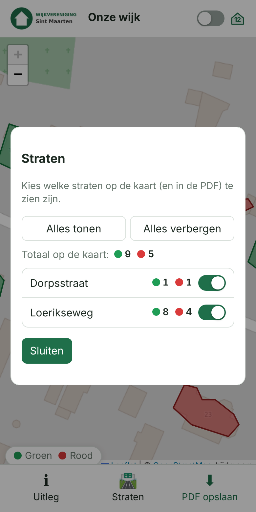</a><br><sub>Straten (mobiel)</sub></td><td align="center" valign="top"><a href="docs/screenshots/info-vlak-mobiel.png">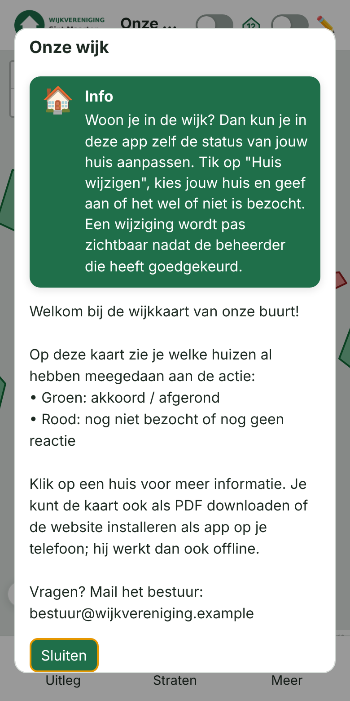</a><br><sub>Infovlak in de uitleg</sub></td></tr>
</table>

**Publieke kaart** – met het logo van de vereniging; klik op een huis voor de notitie. Bovenaan staan de knoppen voor de uitleg, de straten en het menu *Meer* (⋯) met de PDF-knoppen.

**Mobiel** – bovenaan alleen het logo, de titel en de schakelaar voor huisnummers; de acties (uitleg, straten, Meer) staan onderaan, met het statusbalkje (groen/rood) er altijd net boven.

**Straten** – met het straat-icoon (🛣️) in de menubalk zet je per straat de huizen op de kaart (en in de PDF) aan of uit. Per straat staat hoeveel huizen **groen** en **rood** zijn, en bovenaan het totaal van de zichtbare straten.

**Uitleg en infovlak** – de tekst van de vereniging; wordt de eerste keer automatisch getoond en sluit met het kruisje rechtsboven. Bovenaan staat het opvallende groene **infovlak** dat uitlegt dat bewoners hun eigen huis kunnen wijzigen; dat verdwijnt zodra wijzigen is uitgeschakeld.

**PDF-export** – A4 liggend met legenda, aantallen en de datum en het tijdstip (HH:MM) van de stand. Pagina 2 bevat het logo, de uitleg en het overzicht van de gemarkeerde huizen. De PDF volgt de gekozen straten en de huisnummers.

<table>
<tr><td align="center" valign="top"><a href="docs/screenshots/pdf.png"></a><br><sub>PDF: kaart met legenda en aantallen</sub></td><td align="center" valign="top"><a href="docs/screenshots/pdf-toelichting.png"></a><br><sub>PDF: logo, uitleg en overzicht</sub></td></tr>
</table>

## Bewoners: huis wijzigen
- In de **geïnstalleerde app** (PWA) staat in de menubalk altijd een knop **Huis wijzigen**, plus een knop **Sync** (🔄) waarmee je de huizen direct bijwerkt (de app ververst ook zelf elke 30 seconden).
- In een **gewone browser** staat bovenin een schakelaar **Bewerken** (✏️). Die staat **standaard aan** (zet je hem uit, dan onthoudt de browser dat), zodat de knop *Huis wijzigen* in de menubalk staat; zet je hem uit, dan verdwijnt die knop. *PDF opslaan* en *PDF bekijken* staan onder het menu **Meer** (⋯), ook in de app. Het balkje met de statuskleuren zweeft op een klein scherm altijd net boven de menubalk. In de app is deze schakelaar verborgen.

<table>
<tr><td align="center" valign="top"><a href="docs/screenshots/bewerken-meer-mobiel.png">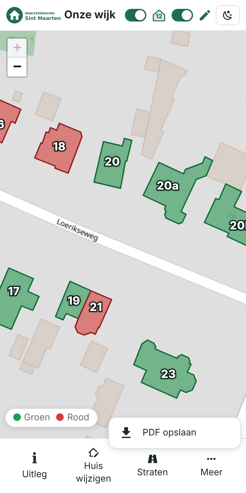</a><br><sub>Menu Meer</sub></td><td align="center" valign="top"><a href="docs/screenshots/bewoner-kies-huis.png">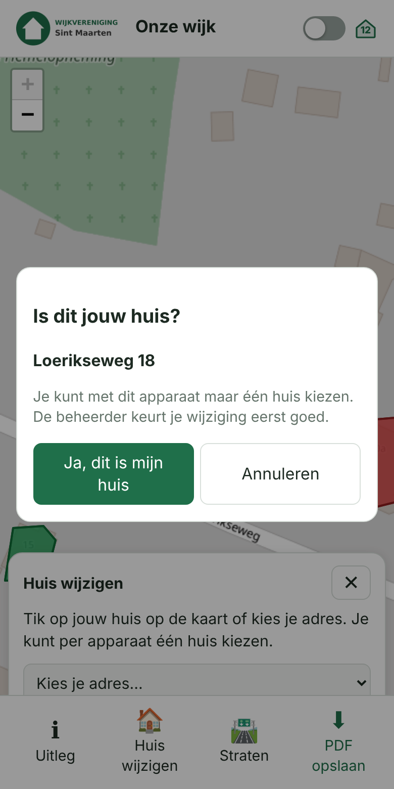</a><br><sub>Huis kiezen</sub></td><td align="center" valign="top"><a href="docs/screenshots/bewoner-wacht.png">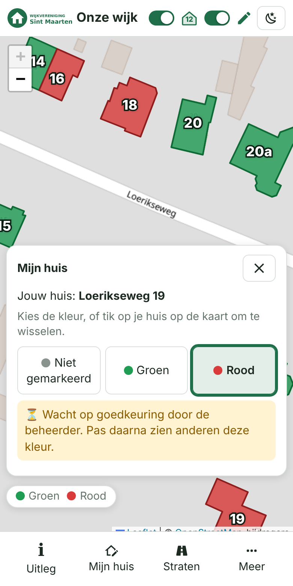</a><br><sub>Wacht op goedkeuring</sub></td><td align="center" valign="top"><a href="docs/screenshots/bewoner-heropend.png">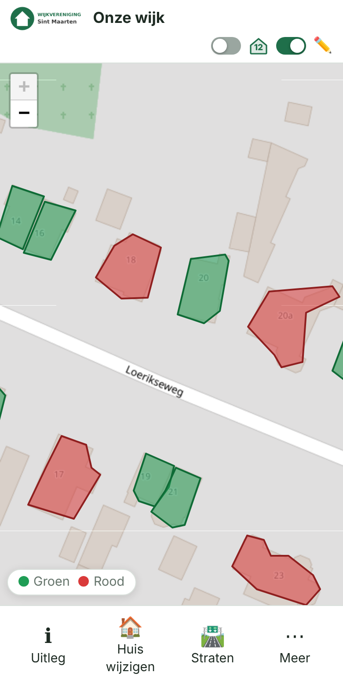</a><br><sub>App heropend: koppeling blijft</sub></td></tr>
</table>

**Snel naar jouw huis** – met een muis dubbelklik je op een huis, op een touchscreen druk je er lang op (ruim een halve seconde). Dan gaat *Bewerken* aan (in de browser), springt de kaart naar het huis en start de wijzigmodus; heb je nog geen huis gekozen, dan vraagt de app of het jouw huis is. Een dubbelklik buiten de huizen zoomt gewoon in. In het beheer selecteert hetzelfde gebaar het huis in de selecteermodus.

**In het beheer** werkt dit ook: dubbelklik (of druk lang) op een huis en de selecteermodus gaat aan met dat huis geselecteerd, ook als je net aan het tekenen was (zolang er nog geen vlak loopt).

### Toegang via QR-code (optioneel)
Wil je dat bewoners alleen hun **eigen huis** kunnen koppelen, dan zet je onder *Instellingen → Bewoners → Toegang via QR-code* de schakelaar *Huis kiezen alleen via QR-code* aan. Elk huis heeft dan een eigen QR-code met een geheim dat **niet** op de kaart staat (de huis-id's zijn openbaar, daarom is het geheim apart).
- **Uitdelen:** kies *QR-codes afdrukken (PDF)* (alle straten of één straat): een A4 met per huis een kaartje met adres en QR, om bij de bewoners te bezorgen. Bij een geselecteerd huis in de editor staat een knop **QR-code** om de code te tonen, de **link te kopiëren**, als PNG te downloaden of te **vernieuwen**.
- **Bewoner:** scant de code met de camera van de telefoon, bevestigt "Is dit jouw huis?" en kan daarna het huis wijzigen. In het scherm *Huis wijzigen* staat zonder koppeling alleen de uitleg om te scannen; de kaart en de adreslijst werken dan niet meer voor het kiezen van een huis.
- **Eén apparaat per huis:** is een huis al gekoppeld, dan weigert de server een tweede apparaat. Verwijder de koppeling (*Instellingen → Bewoners → Apparaten*) om opnieuw te kunnen scannen.
- **Intrekken:** *Vernieuwen* (per huis of alle huizen) maakt de oude QR-codes ongeldig.
- **Combinatie:** een geldige QR vervangt de toegangscode voor apparaten zonder GPS; de locatiecontrole en de goedkeuring door de beheerder blijven gelden. Schakel je QR-only uit, dan werkt alles weer zoals voorheen (kaart/lijst).
- **Let op:** een QR is zo veilig als de brief: wie hem fotografeert, kan hem gebruiken (daarom één apparaat per huis, vernieuwen en jouw goedkeuring). Op iPhone opent een gescande link in de browser, niet in de geïnstalleerde app; gebruik je *Alleen in de geïnstalleerde app*, dan moet de bewoner na het scannen de app openen. De geheimen staan in `data/db.json`, niet in de backups.

<table>
<tr><td align="center" valign="top"><a href="docs/screenshots/qr-instellingen.png">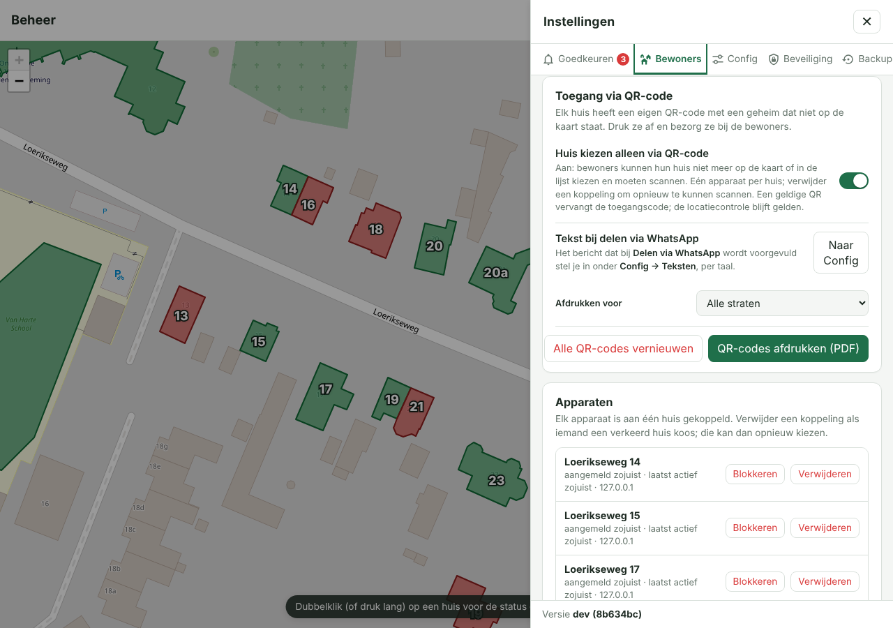</a><br><sub>Instellingen: Toegang via QR-code</sub></td><td align="center" valign="top"><a href="docs/screenshots/qr-dialoog.png">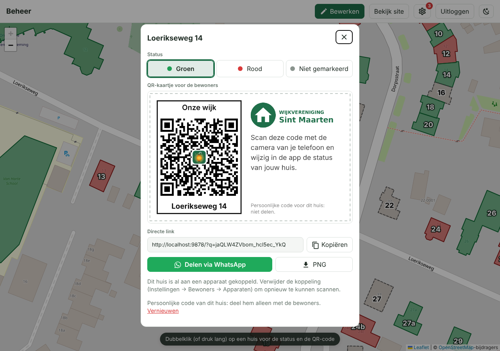</a><br><sub>QR-code van één huis</sub></td></tr>
<tr><td align="center" valign="top"><a href="docs/screenshots/qr-pdf.png">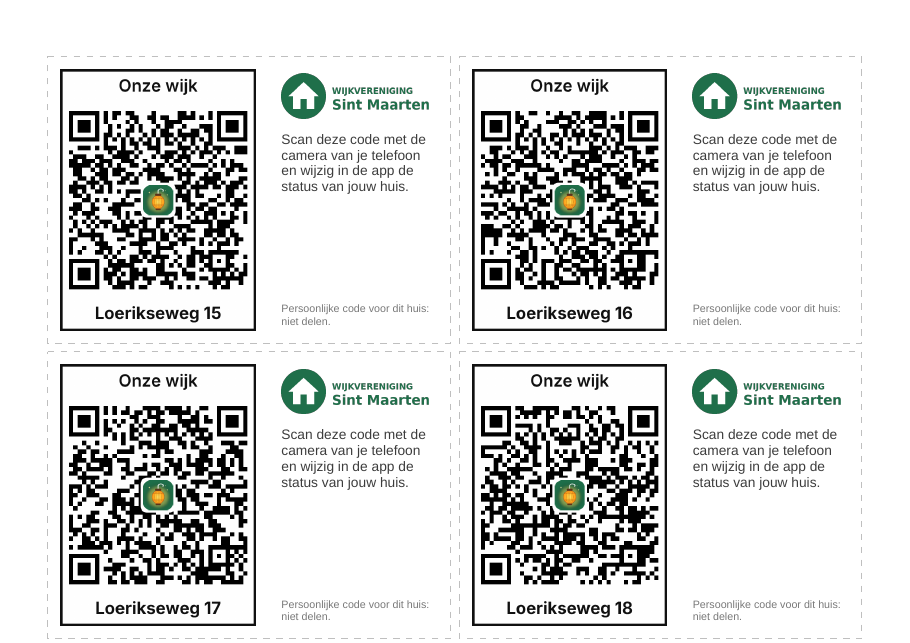</a><br><sub>Afdrukbare PDF met een kaartje per huis</sub></td><td align="center" valign="top"><table><tr><td align="center" valign="top"><a href="docs/screenshots/qr-bevestigen.png">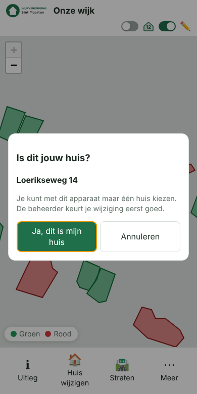</a><br><sub>Na het scannen: bevestigen</sub></td><td align="center" valign="top"><a href="docs/screenshots/qr-zonder-scan.png">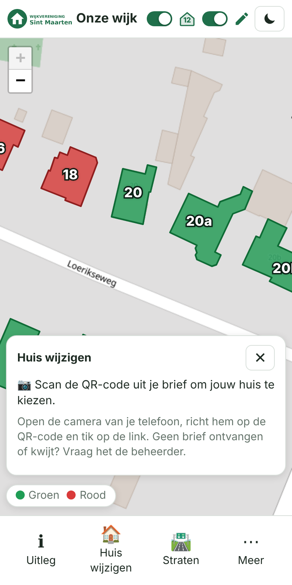</a><br><sub>Zonder QR (QR-only)</sub></td></tr></table></td></tr>
</table>

**Wijzigen plannen** – zet onder *Instellingen → Bewoners → Planning* de schakelaar *Wijzigen uitschakelen op een datum en tijd* aan en kies met de datum-/tijdkiezer wanneer. Tot dat moment kunnen bewoners wijzigen (browser én app); daarna staat het uit. De twee schakelaars eronder worden in die tijd uitgeschakeld en genegeerd; zet je de planning uit, dan gelden ze weer.

**Na de einddatum nog groen ↔ rood wisselen** – naast de planning staat de schakelaar *Na die datum mogen bewoners hun eigen huis nog wisselen tussen groen en rood*. Staat die aan, dan kunnen bewoners die al een huis hebben na de einddatum nog hun eigen huis wisselen van groen naar rood of andersom (niet van of naar *niet gemarkeerd*, en geen nieuw huis kiezen), nog steeds met jouw goedkeuring. De knop *Huis wijzigen* toont dan alleen nog die twee kleuren; bezoekers zonder huis zien de knop (en *Bewerken*) niet meer. Deze schakelaar gaat voor de twee schakelaars eronder en werkt alleen als de planning aan staat.

**Eenvoudige weergave** – onder *Instellingen → Site → Weergave* zet je *Eenvoudige weergave* aan. Op de website verdwijnen dan de schakelaars *Huisnummers* en *Bewerken* en de knop *Straten*; *Uitleg*, *Huis wijzigen* en *PDF opslaan* staan dan direct in de menubalk (het menu *Meer* vervalt) en Bewerken staat vast aan.

**Toegangscode voor apparaten zonder GPS (optioneel)** – onder *Instellingen → Bewoners → Toegang* stel je een code van 4 tot 6 cijfers in (of kies *Willekeurig*) en zet je de schakelaar aan. Wie dan op een laptop of desktop op *Huis wijzigen* drukt, krijgt eerst een veld om de code in te vullen (die deel je bijvoorbeeld in de buurtapp op WhatsApp). Het apparaat onthoudt de code (cookie, 1 jaar); wijzig je de code, dan moet iedereen hem opnieuw invullen. Telefoons en tablets met GPS hoeven niets in te vullen. Standaard staat dit uit. Foute pogingen worden per IP-adres beperkt. Het is een gebruiksbeperking, geen harde beveiliging (de code staat bij de beheerder in leesbare vorm, en het apparaattype komt van de browser).

**Geofence (optioneel)** – onder *Instellingen → Bewoners → Toegang* zet je de schakelaar *Alleen in de wijk (locatie)* aan en kies je een straal (50–5000 m, standaard 500). Het midden is het midden van de kaartweergave (of anders van de huizen). De controle geldt **alleen voor telefoons en tablets met GPS**; laptops en desktops (zonder GPS) worden niet beperkt en kunnen gewoon wijzigen. Bij het openen van de wijzigmodus en bij elke wijziging vraagt de browser om de locatie; staat die buiten de straal, is hij minder nauwkeurig dan 200 m, uit of niet toegestaan, dan kan er niet worden gewijzigd en volgt een duidelijke melding. De kaart bekijken kan overal. Vereist HTTPS. De locatie komt van het apparaat zelf en de server kan die niet controleren: het is een gebruiksbeperking, geen harde beveiliging.

**Infovlak** – onder *Instellingen → Site → Teksten* staat een apart tekstveld voor het infovlak. Dat staat als opvallend groen blok bovenaan de uitleg op de website en legt uit dat bewoners hun eigen huis kunnen wijzigen. Het verdwijnt vanzelf zodra wijzigen door bewoners uit staat (of de geplande datum is verstreken).

**Misbruik tegengaan** – onder *Instellingen → Goedkeuren* en *Bewoners → Apparaten* staat bij elke openstaande wijziging en bij elk aangemeld apparaat een knop **Blokkeren**. Het apparaat verliest zijn koppeling en openstaande wijzigingen, en kan niet meer wijzigen of een huis kiezen. Je kunt er ook het **IP-adres** bij blokkeren (let op: huisgenoten of buren achter dezelfde router delen vaak een IP). Onder *Geblokkeerd* haal je een blokkade weer weg.

**Alleen in de app toestaan** – onder *Instellingen → Bewoners* zet je **Alleen in de geïnstalleerde app** aan. De schakelaar *Bewerken* verdwijnt dan voor browserbezoekers (ook bij een open pagina, na het verversen), en de server weigert wijzigingen die niet vanuit de app komen. De app meldt zich daarvoor met een kop (`X-App-Mode: standalone`). Dat is een gebruiksbeperking: wie de verzoeken zelf nabootst kan de kop meesturen, maar elke wijziging moet nog steeds door de beheerder worden goedgekeurd.

- Een bewoner tikt op zijn huis (of kiest zijn adres) en bevestigt dat. Dat apparaat is dan aan **één huis** gekoppeld (cookie, 1 jaar). Daarna wisselt elke tik op dat huis (of een keuze in het venster) de kleur: niet gemarkeerd → groen → rood → niet gemarkeerd. Andere huizen kunnen niet worden gewijzigd.
- De wijziging is **pas zichtbaar voor anderen nadat de beheerder die goedkeurt**. De bewoner ziet het huis in de tussentijd met een gestippelde rand en de melding *Wacht op goedkeuring*; na de beslissing volgt een bericht (goedgekeurd of niet doorgevoerd). De beheerder kan de status van een huis altijd zelf aanpassen; een openstaand voorstel volgt dan de nieuwe status of vervalt als het precies overeenkomt.
- Er worden alleen een willekeurig apparaat-token (als hash), het IP-adres van het laatste verzoek (voor het blokkeren) en het gekozen huis bewaard, geen namen of andere persoonsgegevens.
- De koppeling en het voorstel blijven **bewaard na het afsluiten van de app**: ze staan op de server, met een lokale kopie van het token als reserve (voor als de cookie wordt gewist) en van de laatste status (voor als er geen verbinding is). Het eigen huis blijft ook buiten de wijzigmodus zichtbaar (⏳ zolang de wijziging op goedkeuring wacht, daarna 🏠).
- De app **ververst zichzelf** (elke 30 seconden, en zodra je terugkeert naar de app of weer online bent). Keurt de beheerder een wijziging goed, dan verschijnt die vanzelf op het apparaat, inclusief een melding "Je wijziging is goedgekeurd".

## Het beheer (`/beheer`)

<table>
<tr><td align="center" valign="top"><a href="docs/screenshots/onboarding.png"></a><br><sub>Onboarding met installatiecode</sub></td><td align="center" valign="top"><a href="docs/screenshots/beheer-login.png"></a><br><sub>Inloggen met passkey</sub></td></tr>
<tr><td align="center" valign="top"><a href="docs/screenshots/beheer-tekenen.png"></a><br><sub>Huis tekenen</sub></td><td align="center" valign="top"><a href="docs/screenshots/beheer.png"></a><br><sub>Huis bewerken</sub></td></tr>
</table>

**Onboarding** – de eerste keer maak je een passkey aan met de installatiecode (`SETUP_TOKEN`).

**Inloggen** – met passkey (vingerafdruk, gezicht, pincode of beveiligingssleutel), eventueel met wachtwoord dat je met een passkey bevestigt.

**Huis tekenen** – kies een kleur en klik de hoekpunten van het huis; sluit af met het gele beginpunt, dubbelklik of Enter. Nieuwe huizen krijgen standaard *geen status* en de actieve straat.

**Huis bewerken** – selecteer een huis (klik, dubbelklik of lang indrukken) om de kleur, straat, huisnummer en notitie aan te passen, of sleep de hoekpunten. Sneltoetsen: **G** groen, **R** rood, **Delete** verwijderen, **Ctrl+S** opslaan. De lijst links heeft een filter per straat; de rest wordt op de kaart gedimd.

## Instellingen
Het tandwiel (⚙) in de balk schuift het instellingen-menu in beeld. Het is ingedeeld in vijf tabs; elke tab bestaat uit kaarten met duidelijke schakelaars en een korte uitleg (ook op een telefoon).

<table>
<tr><td align="center" valign="top"><a href="docs/screenshots/instellingen-goedkeuren.png">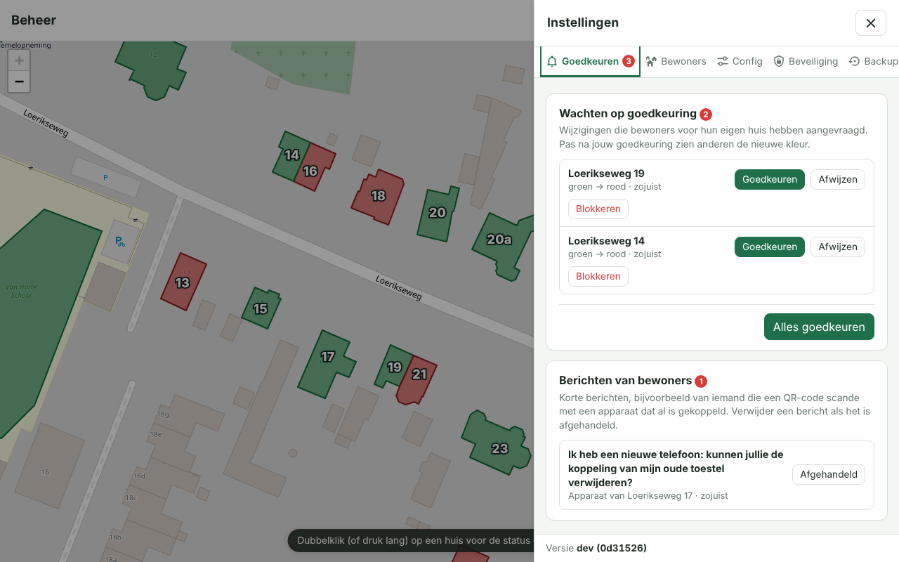</a><br><sub>Goedkeuren</sub></td><td align="center" valign="top"><a href="docs/screenshots/instellingen-bewoners.png">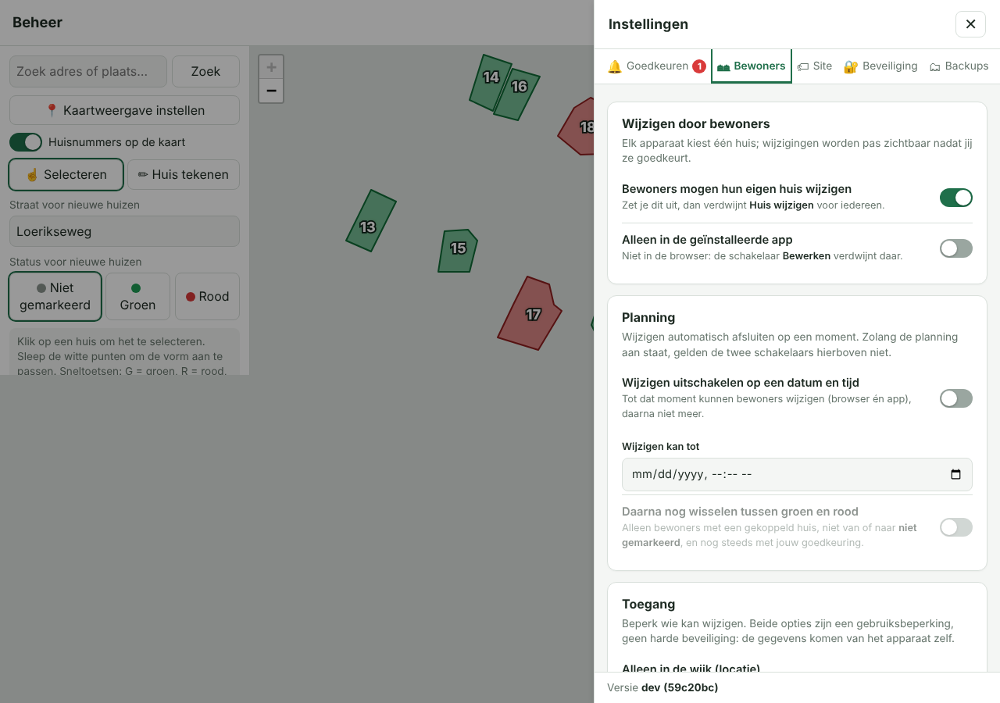</a><br><sub>Bewoners</sub></td><td align="center" valign="top"><a href="docs/screenshots/instellingen-bewoners-apparaten.png">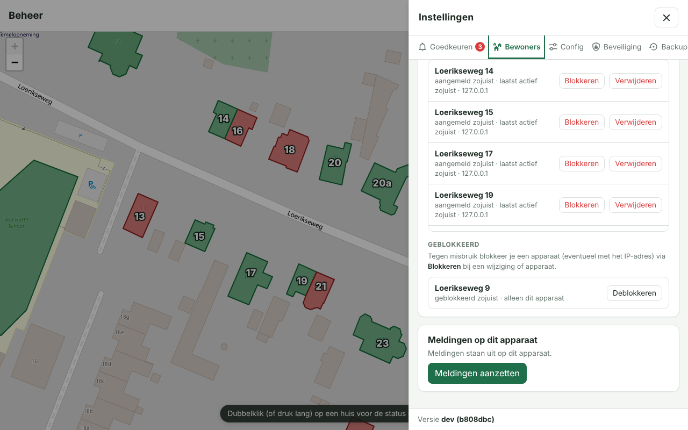</a><br><sub>Bewoners: apparaten en meldingen</sub></td></tr>
<tr><td align="center" valign="top"><a href="docs/screenshots/instellingen-site.png">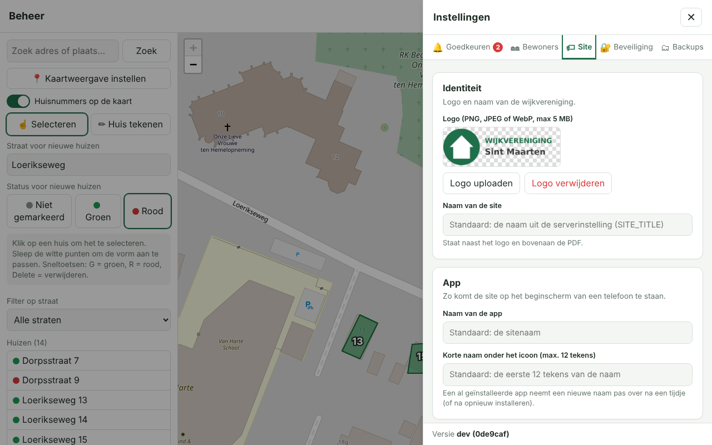</a><br><sub>Site</sub></td><td align="center" valign="top"><a href="docs/screenshots/instellingen-beveiliging.png"></a><br><sub>Beveiliging</sub></td><td align="center" valign="top"><a href="docs/screenshots/instellingen-backups.png"></a><br><sub>Backups</sub></td></tr>
</table>

<p align="center"><a href="docs/screenshots/instellingen-mobiel.png">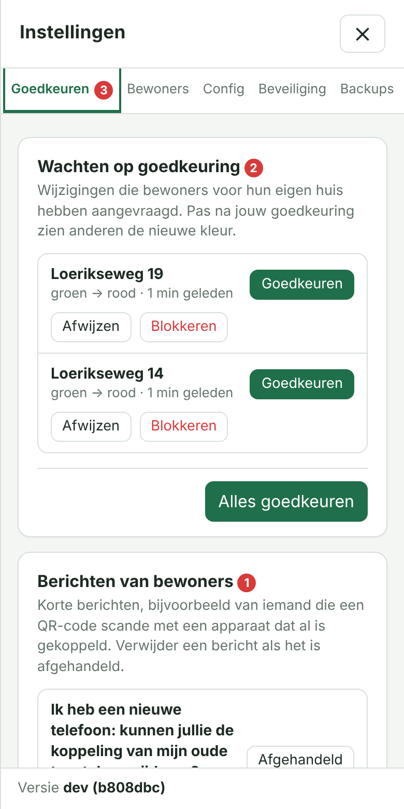</a><br><sub>Instellingen op een telefoon</sub></p>

**Goedkeuren** – de wijzigingen die bewoners voor hun eigen huis hebben aangevraagd. Een rode teller bij het tandwiel en bij de tab toont het aantal; keur ze goed of af, of alles tegelijk.

**Bewoners** – alles rond het wijzigen door bewoners:
- *Wijzigen door bewoners*: aan/uit, en eventueel alleen in de geïnstalleerde app (de schakelaar *Bewerken* verdwijnt dan in de browser en de server weigert wijzigingen zonder de app-kop `X-App-Mode: standalone`).
- *Planning*: wijzigen automatisch afsluiten op een datum en tijd (met datumkiezer), met eventueel daarna nog groen ↔ rood wisselen.
- *Toegang*: alleen in de wijk (locatie/geofence) en een toegangscode voor apparaten zonder GPS.
- *Apparaten*: aangemelde apparaten (koppeling verwijderen of **blokkeren**, eventueel met IP-adres) en de lijst *Geblokkeerd*.
- *Meldingen op dit apparaat*: pushmeldingen voor nieuwe wijzigingen.

**Site** – logo, naam van de site en de app, de eenvoudige weergave, de namen van de statussen, het infovlak en de uitleg.

**Beveiliging** – passkeys toevoegen/verwijderen en een optioneel wachtwoord (bevestigen met passkey).

**Backups** – na elke opslagpoging wordt automatisch een backup gemaakt van de layout en teksten. Geef een backup een **korte titel** (✎, max. 40 tekens, bijvoorbeeld "Alles" of "Alleen layout") of maak er zelf een met *Backup maken*. Terugzetten of downloaden kan altijd; verwijderen (één of meer tegelijk) moet je bevestigen met je passkey.

**Versie** – onderin het menu staat de versie en commit van de draaiende build (zie [Versienummer](#versienummer)).

### Pushmeldingen voor de beheerder
- Zet in *Instellingen → Bewoners → Meldingen op dit apparaat* meldingen aan op je eigen telefoon of computer. De server maakt daarvoor zelf de (VAPID-)sleutels en bewaart ze in `data/db.json`.
- Bij een nieuwe wijziging ontvang je een pushmelding (meerdere wijzigingen kort na elkaar worden samengevoegd). Tik je erop, dan opent het beheer bij *Wijzigingen* en kun je goedkeuren of afwijzen; pas dan wordt de wijziging doorgevoerd.
- Vereist **HTTPS**. Op een iPhone/iPad werkt Web Push alleen als je het beheer eerst aan het beginscherm toevoegt (iOS 16.4 of nieuwer) en het daar opent. Een knop *Testmelding* controleert of het werkt.
- Verlopen apparaten worden automatisch opgeruimd.

## Namen van de statussen
Onder *Instellingen (⚙) → Site → Weergave* kun je de namen **Groen**, **Rood** en **Niet gemarkeerd** aanpassen, bijvoorbeeld naar *Akkoord* en *Nog niet bezocht*. De kleuren blijven groen en rood. De namen gelden overal: legenda, popups, straten-filter, de PDF, het beheer en de pushmelding. Leeg laten = standaardnaam.

## Nieuwe huizen tekenen
Een nieuw getekend huis heeft standaard **geen status** (niet gemarkeerd; kies in het beheer desgewenst een andere status voor nieuwe huizen). Het veld **Straat voor nieuwe huizen** toont de actieve of laatst gebruikte straat: die volgt het huis dat je selecteert, het straat-filter of wat je zelf invult. Nieuwe, nog lege huizen krijgen die straat vooraf ingevuld, zodat je alleen het huisnummer hoeft in te vullen.

## Huisnummers en straten
- In het beheer heeft elk huis een **straat** en een **huisnummer** (aparte velden; het straatveld stelt bestaande straten voor). Met *Filter op straat* toon je alleen de huizen van één straat in de lijst; de rest wordt op de kaart gedimd.
- De schakelaar *Huisnummers op de kaart* toont het nummer midden op elk huis (wit met donkere rand, dus goed leesbaar). Nummers die niet in het huis passen verdwijnen en komen terug bij verder inzoomen.
- In *Kaartweergave instellen* bepaal je of de nummers voor bezoekers **standaard** aan staan; bezoekers kunnen dat zelf wisselen met de schakelaar in de menubalk (de keuze wordt onthouden).
- Op de site kun je met het straat-icoon per straat de huizen verbergen of tonen. De PDF volgt die keuzes (huisnummers en zichtbare straten).
- Oudere gegevens met één veld *huisnummer/naam* worden automatisch omgezet: dat veld wordt het huisnummer.

## Hoe werkt het
- **Kaart**: OpenStreetMap (via Leaflet), geen API-sleutel nodig. Google Maps is bewust niet gebruikt: dat vereist een betaalde sleutel en de voorwaarden staan het overtekenen en exporteren naar PDF niet toe.
- **Beheer instellen**: zoek je straat en zoom ver in; stel via *Kaartweergave instellen* het midden, de startzoom en de minimale/maximale zoom in (of neem de huidige weergave over). Bezoekers openen de kaart (ook in de app) met precies die weergave; met *Automatisch* toont de site alle huizen. In dezelfde dialoog bepaal je of de huisnummers voor bezoekers standaard aan staan.
- **Onboarding**: de allereerste keer vraagt `/beheer` om de `SETUP_TOKEN` en maakt dan een passkey aan. Daarna kun je via *Instellingen* (⚙) → *Beveiliging* extra apparaten toevoegen (doe dat zodat je niet buitengesloten raakt).

> De PDF haalt kaarttegels rechtstreeks bij OpenStreetMap op; houd het gebruik bescheiden
> ([tile usage policy](https://operations.osmfoundation.org/policies/tiles/)).

## Inloggen met wachtwoord (optioneel)
Standaard kun je alleen met een passkey inloggen. Wil je ook met een wachtwoord kunnen inloggen, stel dat dan in via *Instellingen* (⚙) → *Beveiliging* → *Wachtwoord*
(minimaal 10 tekens). Het instellen, wijzigen of verwijderen moet je **bevestigen met een passkey**. Het wachtwoord wordt alleen als `scrypt`-hash opgeslagen.
Een sessie die met een wachtwoord is gestart kan de kaart en teksten beheren, maar geen passkeys of wachtwoord wijzigen; daarvoor log je in met een passkey.
Mislukte pogingen worden per IP-adres en globaal beperkt.

## Na een update: oude pagina's of scripts
Scripts en stijlen worden per build met `?v=<versie>-<commit>` opgevraagd en de HTML wordt nooit gecachet; zo krijg je nooit een oude `admin.js` bij nieuwe HTML (dat geeft fouten als
*Cannot set properties of null*). Zie je zo'n fout toch na een update, ververs dan hard (Ctrl+Shift+R) of wis de sitegegevens; eventueel staat een proxy/CDN (bijv. Cloudflare) te agressief te cachen.

## Releases en release notes
Bij elke geslaagde build op `main` zet de GitHub Action een tag `vMAJOR.MINOR.PATCH` (zie [Versienummer](#versienummer)) en publiceert hij ook een **GitHub Release** met officiële release notes: [alle releases](../../releases). De notes worden automatisch samengesteld uit de gemergde pull requests sinds de vorige release, ingedeeld in **✨ Nieuwe functies en verbeteringen**, **🐞 Opgeloste problemen** en **📚 Documentatie**, elk met een link naar de PR, plus het `docker pull`-commando voor die versie.
- **Indeling:** een PR uit een branch `fix/…` (of met fix/herstel/crash in de titel) telt als opgelost probleem, een branch `docs/…` als documentatie, de rest als nieuwe functie. Een duidelijke PR-titel en een korte lijst onder *Wijzigingen* in de beschrijving komen dus rechtstreeks in de release notes.
- **Handgeschreven notes:** zet je een bestand `docs/releases/vX.Y.Z.md` neer, dan gebruikt de release dat in plaats van de automatische notes (zo is [v1.0.0](docs/releases/v1.0.0.md) gemaakt).
- **Achteraf (opnieuw) maken:** Actions → *Release* → *Run workflow* en vul de tag in (bijvoorbeeld `v1.0.5`). Lokaal proberen kan met `node tools/release-notes.js vX.Y.Z` (met `GITHUB_TOKEN` en `GITHUB_REPOSITORY` gezet).

## Versienummer
Onderin het instellingenmenu (⚙) staat de versie en de commit van de draaiende build, bijvoorbeeld **v1.0.3 (9f2c4e1)**.
Bij elke geslaagde build van de GitHub Action gaat het patchnummer met 1 omhoog (de eerste build is v1.0.0); de build krijgt een git-tag `v1.0.N` en het image wordt
ook onder die tag gepubliceerd (`ghcr.io/helmerznl/sintmaarten:v1.0.3`). Het deel `1.0` komt uit het bestand `VERSION`: pas dat aan voor een nieuwe minor- of major-versie, dan begint de teller opnieuw bij 0.
Lokaal (zonder build) toont de app `dev` met de commit uit git. De workflow heeft schrijfrechten op de repo nodig om de tag te zetten (staat in `docker.yml`).

## Backups
Na **elke opslagpoging** (huizen/layout, teksten, kaartweergave) maakt de server een JSON-backup in `data/backups/` van de layout (huizen + kaartweergave) en de teksten (uitleg, appnaam).
Identieke staten worden niet dubbel bewaard en de nieuwste 200 blijven staan (`MAX_BACKUPS` om dat aan te passen). Het logo valt buiten de backups.
Terugzetten kan in *Instellingen → Backups* (de huidige staat wordt eerst zelf als backup bewaard); verwijderen vraagt een bevestiging met je passkey.
Elke backup kan een **korte titel** krijgen (max. 40 tekens, knop ✎), bijvoorbeeld "Alles" of "Alleen layout". Met *Backup maken* maak je handmatig een backup met een eigen titel, ook als er niets is veranderd.

## Naam van de app
Bij *Instellingen* (⚙) → *Site* stel je ook de **naam van de site** in (naast het logo en in de PDF; standaard `SITE_TITLE`) en de **naam van de app** en een korte naam (max. 12 tekens, onder het icoon) in. Die worden gebruikt als de site op een telefoon of computer wordt geïnstalleerd.
Zonder invoer geldt de sitenaam (`SITE_TITLE`). Een al geïnstalleerde app neemt een nieuwe naam pas na een tijdje over.

## Beheer als app
Ook het beheer (`/beheer`) is te installeren als eigen app, met een eigen donkerblauwe lantaarn met tandwiel als icoon en een eigen favicon, zodat je het onderscheidt van de publieke kaart (Chrome/Edge: installeer-icoon in de adresbalk of *App installeren*; iPhone/iPad: *Zet in beginscherm*). De app opent direct op `/beheer`; pushmeldingen voor nieuwe wijzigingen gebruiken hetzelfde icoon. Een nieuw icoon maak je met `python3 tools/make-icons.py`.

## Installeren als app en offline gebruik
- **Android en Windows (Chrome/Edge)**: je krijgt **eenmalig** een melding om de app te installeren (*Installeren* / *Niet nu*), per apparaat onthouden. Daarna kan het ook via het browsermenu → *App installeren*.
- **iPhone/iPad**: dezelfde eenmalige melding met uitleg (zie hieronder).
- **iPhone/iPad (Safari)**: deel-icoon → *Zet in beginscherm*.
- **Offline**: de app bewaart zichzelf, de laatst bekende kaartgegevens, het logo en de kaarttegels van het wijkgebied (en de PDF-uitsnede).
  Zonder verbinding zie je de laatst bekende stand (met de melding *Offline*), en de PDF blijft te maken. Alleen het beheer vereist altijd een verbinding.
- Dit werkt alleen via **HTTPS** (zie `ORIGIN`). Na een update van de site haalt de app de nieuwe versie bij het eerstvolgende bezoek op.

## Zelf deployen met Docker
Je draait de app op je eigen Docker-omgeving (NAS, server, Raspberry Pi, VPS) met twee bestanden uit deze repository:

| Bestand | Waarvoor |
| --- | --- |
| [`docker-compose.yml`](docker-compose.yml) | Beschrijft de container: het image `ghcr.io/helmerznl/sintmaarten:latest`, de poort, de map `./data` voor je gegevens en dat de instellingen uit `.env` komen. |
| [`.env.example`](.env.example) | Voorbeeld van je instellingen. Kopieer het naar `.env` en vul het in; `.env` bevat geheimen en hoort **niet** in git. |

Je hoeft de code niet te bouwen: het image wordt door [GitHub Actions](.github/workflows/docker.yml) automatisch gebouwd en gepubliceerd (zie [Dockerfile](Dockerfile) voor de bouwinstructies).

**Stappen**
1. Maak een map op je Docker-host, bijvoorbeeld `sintmaarten`, en download de twee bestanden:
   ```sh
   mkdir sintmaarten && cd sintmaarten
   curl -O https://raw.githubusercontent.com/helmerzNL/Sintmaarten/main/docker-compose.yml
   curl -o .env https://raw.githubusercontent.com/helmerzNL/Sintmaarten/main/.env.example
   ```
   (Of kopieer de inhoud van [`docker-compose.yml`](docker-compose.yml) en [`.env.example`](.env.example) met de hand; `.env.example` sla je op als `.env`.)
2. Vul `.env` in:

   | Variabele | Betekenis |
   | --- | --- |
   | `ORIGIN` | De volledige URL waarmee je de site opent, bijvoorbeeld `https://sintmaarten.flux76.app`. Moet exact het adres in de browser zijn; passkeys werken alleen via **HTTPS** (of op `localhost`). |
   | `SETUP_TOKEN` | Geheime code voor het aanmaken van de allereerste passkey (onboarding). Genereer er een met `openssl rand -hex 12`. |
   | `SESSION_SECRET` | Sleutel voor het ondertekenen van sessies (minstens 16 tekens), bijvoorbeeld `openssl rand -hex 32`. Laat je hem leeg, dan vervallen sessies bij elke herstart. |
   | `SITE_TITLE` | Naam van de site (daarna aan te passen in het beheer). |
   | `PORT` | Poort van de webserver, standaard **9888**. |
   | `RP_ID`, `SESSION_HOURS` | Optioneel; zie de opmerkingen in [`.env.example`](.env.example). |
3. Start de container: `docker compose up -d`. Je gegevens (huizen, passkeys, logo, uitleg, backups) staan in `./data`; de container herstelt zelf de rechten op die map (hij start kort als root en draait de app daarna als gebruiker `node`).
4. Zet een reverse proxy met **HTTPS** voor de poort uit `PORT` (Synology: *Inloggegevens → Reverse Proxy*, of Nginx Proxy Manager / Traefik / Caddy), zodat `ORIGIN` klopt.
5. Open `ORIGIN/beheer` en maak je eerste passkey aan met de `SETUP_TOKEN` (zie [Onboarding](#het-beheer-beheer)).

**Bijwerken:** `docker compose pull && docker compose up -d`. **Back-up:** kopieer de map `data/` (of gebruik de backups in het beheer).

> Is het GHCR-package privé? Maak het publiek (GitHub → Packages → Package settings), of log in met
> `docker login ghcr.io` (gebruikersnaam + Personal Access Token met `read:packages`).

## GitHub Actions
`.github/workflows/docker.yml` draait de tests en bouwt bij elke push naar `main`/`master` een multi-arch image
(amd64 + arm64) naar `ghcr.io/helmerznl/sintmaarten:latest`. Update op de NAS met `docker compose pull && docker compose up -d`.

## Lokaal ontwikkelen
```
npm install
ORIGIN=http://localhost:9888 SETUP_TOKEN=lokaal-test-token-1 npm start
npm test
```

## Beveiliging
Passkeys via WebAuthn (SimpleWebAuthn), sessiecookie `HttpOnly`/`SameSite=Strict`/`Secure`, origin-check op wijzigingen,
beperking op mislukte pogingen.
Back-up: kopieer de map `data/`. Passkey kwijt en geen ander apparaat? Zet in `data/db.json`
`"passkeys": []` en doorloop de onboarding opnieuw.
